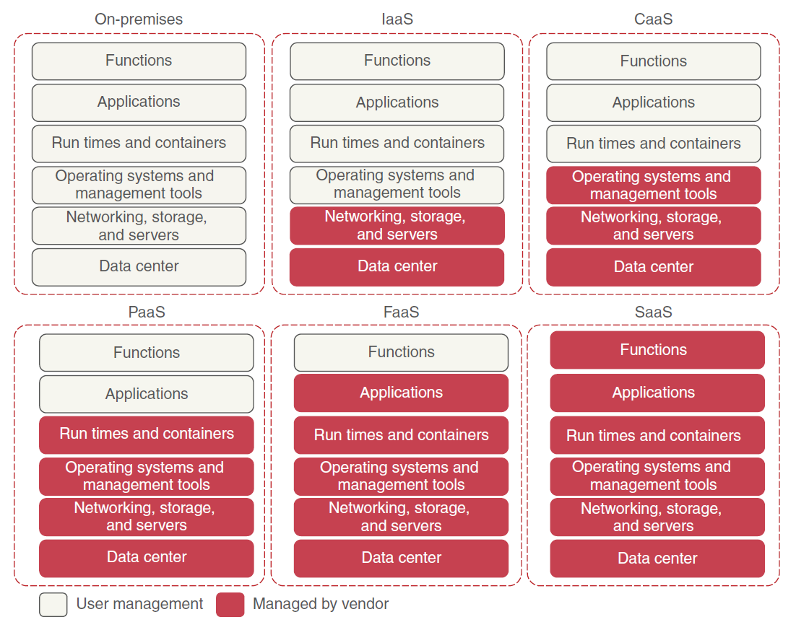

# Software Development and Engineering

> Learn from everyone. Follow no one.

> What we think, we become.

> No silver bullet.

### Content

- Part I: Software Development
  - <a name="sdp_c" href="#sdp_t">Software Development Principles</a>
  - <a name="code_c" href="#code_t">Code</a>
  - <a name="devtools_c" href="#devtools_t">Development Tools</a>
  - <a name="lowcode_c" href="#lowcode_t">Low-Code and No-Code</a>
  - <a name="xaas_c" href="#xaas_t">Anything as a Service</a>
- Part II: Software Design
  - <a name="designpatterns_c" href="#designpatterns_t">Design Patterns</a>
  - <a name="archdes_c" href="#archdes_t">Architecture Design</a>
- Part III: Software Operations & Maintenance
  - <a name="devops_c" href="#devops_t">DevOps</a>
  - <a name="pe_c" href="#pe_t">Platform Engineering</a>
  - <a name="sre_c" href="#sre_t">SRE</a>
  - <a name="chaos_c" href="#chaos_t">Chaos Engineering</a>
- Part IV: Software Engineering & Project Management
  - <a name="softeng_c" href="#softeng_t">Software Engineering</a>
  - <a name="spm_c" href="#spm_t">Software Project Management</a>
  - <a name="test_c" href="#test_t">Software Testing and Quality Assurance</a>
- Part V: Others
  - <a name="career_c" href="#career_t">Career</a>
  - <a name="law_c" href="#law_t">Law</a>
  - <a name="health_c" href="#health_t">Health</a>
  - Remote Work (Work From Home)

## Part I: Software Development

 

<h2><a name="sdp_t" href="#sdp_c">Software Development Principles</a></h2>

 

**DRY (Don't Repeat Yourself)**: This principle emphasizes the importance of reusing code and avoiding duplication. It encourages developers to write code that is reusable, modular, and maintainable.

**KISS (Keep It Simple, Stupid)**: This principle promotes simplicity in software development. It encourages developers to write simple, clear, and straightforward code that is easy to understand and maintain.

**YAGNI (You Ain't Gonna Need It)**: This principle advises developers not to implement functionality until it is actually needed. It encourages developers to avoid over-engineering and unnecessary complexity.

**SOLID**: SOLID is an acronym for five design principles - Single Responsibility Principle, Open-Closed Principle, Liskov Substitution Principle, Interface Segregation Principle, and Dependency Inversion Principle. These principles help in designing modular, maintainable, and extensible software.

**Agile Principles**: Agile principles, as defined in the Agile Manifesto, emphasize iterative and incremental development, collaboration, and responding to change. These principles guide the development process and promote adaptability, customer satisfaction, and continuous improvement.

**Test-Driven Development (TDD)**: TDD is a software development approach that involves writing automated tests before writing the actual code. This principle ensures that the code is thoroughly tested and helps in maintaining code quality and preventing regressions.

**Continuous Integration and Deployment (CI/CD)**: CI/CD principles involve automating the process of integrating code changes, running tests, and deploying software. This principle ensures that code changes are frequently integrated and tested, leading to faster feedback and more reliable releases.

**Separation of Concerns (SoC)**: SoC is a design principle that advocates splitting software into distinct modules or components, each responsible for a specific concern. This principle helps in achieving modularity, maintainability, and reusability.

**Don't Optimize Prematurely**: This principle advises developers not to optimize code for performance prematurely. It suggests focusing on writing clean and maintainable code first and optimizing it only when necessary.

**Documentation**: Documentation is an essential principle in software development. It involves writing clear, concise, and up-to-date documentation to aid understanding, maintenance, and collaboration among developers.

 

<h2><a name="code_t" href="#code_c">Code</a></h2>
 

> Any fool can write code that a computer can understand. Good programmers write code that humans can understand. - Martin Fowler

> First, solve the problem. Then, write the code. - John Johnson

> Make it work, make it right, make it fast. - Kent Beck

> Premature optimization is the root of all evil. - Donald Knuth

Clean Code

- **Clean Code : A Handbook of Agile Software Craftsmanship** (2008) by Robert C. Martin, Prentice Hall
- **Code Complete** (2nd, 2004) by Steve McConnell
- **The Practice of Programming** (1999) by Brian W. Kernighan
- **Hacker's Delight** (2nd, 2012) by Henry S. Warren Jr.
- Write Great Code: Volume 1: Understanding the Machine by Randall Hyde
- Write Great Code: Volume 2: Thinking Low-Level, Writing High-Level by Randall Hyde
- Write Great Code, Volume 3: Engineering Software by Randall Hyde
- Writing Solid Code by Steve Maguire
- The Art of Readable Code by Dustin Boswell, Trevor Foucher
- Think Like a Programmer: An Introduction to Creative Problem Solving by V. Anton Spraul
- Seriously Good Software: Code that works, survives, and wins (2020) by Marco Faella
- The Art of Clean Code: Best Practices to Eliminate Complexity and Simplify Your Life (2022) by Christian Mayer
- 码出高效：Java开发手册 by 杨冠宝, 高海慧
- 码农翻身 (2018) by 刘欣

Refactoring

- **Refactoring: Improving the Design of Existing Code** (2nd, 2018) by Martin Fowler, Kent Beck 
- **Refactoring to Patterns** (2004) by Joshua Kerievsky
- **Working Effectively with Legacy Code** (2004) by Michael C. Feathers

Test-Driven Development (TDD)

- **Test Driven Development: By Example** (2002) by  Kent Beck 
- Agile Java: Crafting Code with Test-Driven Development by Jeff Langr

Unit Testing

- **Growing Object-Oriented Software, Guided by Tests** (2009) by Steve Freeman
- Unit Testing: Principles, Practices, and Patterns by Vladimir Khorikov
- Effective Unit Testing by Lasse Koskela
- xUnit Test Patterns: Refactoring Test Code by Gerard Meszaros (.NET)
- The RSpec Book by David Chelimsky
- The Art of Unit Testing: With Examples in .NET by Roy Osherove

Performance

- Every Computer Performance Book: How to Avoid and Solve Performance Problems on The Computers You Work With by Bob Wescott, Anna Macijeski
- Code Optimization: Effective Memory Usage by Kris Kaspersky

Debugging

- Debugging: The 9 Indispensable Rules for Finding Even the Most Elusive Software and Hardware Problems by David J Agans

 

<h2><a name="devtools_t" href="#devtools_c">Development Tools</a></h2>

 

### AI code completion tool

- [GitHub Copilot](https://copilot.github.com/) + GitHub Copilot Chat by GitHub and OpenAI
  - Individual: $10/month or $100/year
  - Organization: 
    - Copilot Business: $19/user/month
- [Codeium](https://codeium.com/)
  - Individual: $0
  - Teams: $12/user/month
- [Amazon CodeWhisperer](https://aws.amazon.com/codewhisperer/)
  - Individual: $0
  - Professional: $19/user/month
- [tabnine](https://www.tabnine.com/) 
  - Basic code completion: $0
  - AI code completions: $12/user/month
- [OpenAI Codex](https://openai.com/blog/openai-codex/)

### Chatbot

#### AI Chatbot

Official Chatbot

|Chatbot|Model|Features|
|---|---|---|
|[ChatGPT by Open AI](https://chat.openai.com/)|GPT-3.5, GPT-4 |Best overall|
|[Microsoft Copilot Pro](https://www.microsoft.com/en-us/store/b/copilotpro)|GPT-4 |Web Search|
|[Bard by Google](https://bard.google.com/chat)|Gemini Pro|Integration with Google apps|
|[Claude by Anthropic](https://claude.ai)|Claude|Longest conversation memory|

Chatbot wrapper

- [Perplexity AI](https://www.perplexity.ai/). Web search.
- [YouChat](https://you.com/). Web search.
- [Poe](https://poe.com/). Multiple AI models. 

#### AI Models

- Open AI - GPT-4-Turbo
- Google - Bard (Gemini Pro)
- Mistral - Mistral Medium
- Anthropic - Claude
- Meta - Llama-2

[LMSys Chatbot Arena Leaderboard](https://huggingface.co/spaces/lmsys/chatbot-arena-leaderboard)

### Git

- Pro Git by Ben Straub and Scott Chacon
- Version Control with Git: Powerful Tools and Techniques for Collaborative Software Development by Jon Loeliger
- Professional Git by Brent Laster
- Git Pocket Guide: A Working Introduction by Richard E. Silverman

 

<h2><a name="lowcode_t" href="#lowcode_c">Low-Code and No-Code</h2></a>

 

- [Amazon Honeycode](https://www.honeycode.aws/). Build a better way to work.
- [Google AppSheet](https://www.appsheet.com/). The intelligent no‑code platform.
- [Axelor](https://www.axelor.com/). Open Source Low-code Platform for Business Process Apps. [GitHub](https://github.com/axelor)

 

<h2><a name="xaas_t" href="#xaas_c">Anything as a Service (XaaS)</a></h2>

 

### Infrastructure as a service (IaaS)

> Infrastructure as a Service (IaaS)—The vendor provides the infrastructure that lets you access computing resources such as servers, storage, and networks. In this model, the user is responsible for everything related to the maintenance of the infrastructure and the scalability of the application.

Top IaaS Providers

1. Amazon Web Services (AWS) - Amazon Elastic Compute Cloud (EC2)
2. Microsoft Azure - Azure Virtual Machines
3. Google Cloud Platform (GCP) - Google Compute Engine (GCE)
4. IBM Cloud - IBM Virtual Servers
5. Oracle Cloud Infrastructure (OCI) - Oracle Compute
6. Alibaba Cloud - Elastic Compute Service (ECS)

### Container as a Service (CaaS)

> An intermediate model between the IaaS and the PaaS, it refers to a form of container-based virtualization. Unlike an IaaS model, where a developer manages the virtual machine to which the service is deployed, with CaaS, you deploy your microservices in a lightweight, portable virtual container (such as Docker) to a cloud provider. The cloud provider runs the virtual server the container is running on, as well as the provider’s comprehensive tools for building, deploying, monitoring, and scaling containers.

Top CaaS Providers

1. Amazon Elastic Container Service (ECS)
2. Google Kubernetes Engine (GKE)
3. Microsoft Azure Kubernetes Service (AKS)
4. IBM Cloud Kubernetes Service
5. Docker Enterprise
6. Red Hat OpenShift

### Platform as a service (PaaS)

> Platform as a service (PaaS) is a cloud computing model where a third-party provider delivers hardware and software tools to users over the internet. PaaS frees developers from having to install in-house hardware and software to develop or run a new application.
>
> This model provides a platform and an environment that **allow users to focus on the development, execution, and maintenance of the application**. The applications can be created with **tools that are provided by the vendor** (for example, **operating system, database management systems, technical support, storage, hosting, network, and more**). Users do not need to invest in a physical infrastructure, nor spend time managing it, allowing them to concentrate exclusively on the development of applications.

Top PaaS Providers

1. Amazon Web Services (AWS) Elastic Beanstalk: AWS Elastic Beanstalk is a fully managed PaaS offering by Amazon Web Services. It supports various programming languages and platforms, providing an easy way to deploy and scale applications without managing the underlying infrastructure. 
2. Microsoft Azure App Service
3. Google Cloud Platform (GCP) App Engine
4. Heroku: Heroku is a popular PaaS provider known for its simplicity and ease of use. It supports several programming languages and frameworks, making it easy to deploy and scale applications. Heroku provides a seamless integration with Git and offers a wide range of add-ons for additional functionality.

### Function as a Service (FaaS)

> FaaS (Function-as-a-Service) is a type of cloud-computing service that allows you to execute code in response to events without the complex infrastructure typically associated with building and launching microservices applications.

FaaS Providers

1. [Amazon Web Services (AWS) Lambda](https://aws.amazon.com/lambda/)
2. Microsoft Azure Functions
3. Google Cloud Functions
4. IBM Cloud Functions
5. Alibaba Cloud Function Compute
6. Oracle Functions

NOTE If you’re not careful, FaaS-based platforms can lock your code into a cloud vendor platform because your code is deployed to a vendor-specific runtime engine. With a FaaS-based model, you might be writing your service using a general programming language (Java, Python, JavaScript, and so on), but you’re still tying yourself to the underlying vendor’s APIs and runtime engine that your function will be deployed to.

### Artificial intelligence as a Service (AIaaS)

> Artificial Intelligence as a Service (AIaaS) is the third party offering of artificial intelligence (AI) outsourcing. AI as a service allows individuals and companies to experiment with AI for various purposes without large initial investment and with lower risk.

AIaaS Providers

- [OpenAI](https://platform.openai.com/overview)

### Backend as a Service (BaaS)

>Backend as a Service (BaaS), also known as Mobile Backend as a Service (MBaaS), is a cloud computing model that provides developers with a pre-built backend infrastructure for their applications. It allows developers to focus on building the frontend or client-side of their applications without worrying about server-side infrastructure management.

>In BaaS, the backend infrastructure, including servers, databases, storage, and other resources, is provided and managed by a third-party service provider. Developers can access these services through APIs (Application Programming Interfaces) to perform tasks such as data storage, user authentication, push notifications, file storage, and more.

Top BaaS Providers

1. Firebase: Firebase, owned by Google, offers a comprehensive suite of backend services, including real-time database, authentication, hosting, storage, and more.
2. AWS Amplify: Amplify, provided by Amazon Web Services (AWS), offers a range of services for building scalable and secure applications, including authentication, storage, APIs, and more.
3. Parse: Parse is an open-source BaaS platform that provides services like database management, user authentication, push notifications, and cloud storage.

### Software as a service (SaaS)

> Software as a service (or SaaS) is a way of delivering applications over the Internet—as a service. Instead of installing and maintaining software, you simply access it via the Internet, freeing yourself from complex software and hardware management.

Top SaaS Companies

- Adobe
- Atlassian
- Freshworks
- Google
- Microsoft
- Salesforce
- SAP
- ServiceNow
- Zoho
- Zoom

### Cloud Database Service

Top Cloud Databases providers

1. Amazon Web Services (AWS) - Amazon RDS, Amazon DynamoDB (NoSQL key-value database), Amazon Aurora (global-scale RDS), Amazon DocumentDB (document database), Amazon Neptune (graph database), etc.
2. Microsoft Azure - Azure SQL Database, Azure Cosmos DB, Azure Database for PostgreSQL, Azure Database for MySQL, Azure Cache for Redis, etc.
3. Google Cloud Platform (GCP) - Cloud SQL, Cloud Spanner, Firestore, Bigtable, Memorystore for Redis, etc.
4. IBM Cloud - IBM Db2 on Cloud, IBM Cloud Databases for PostgreSQL, IBM Cloud Databases for MongoDB, IBM Db2 Warehouse on Cloud, etc.
5. Oracle Cloud Infrastructure (OCI) - Oracle Autonomous Database, Oracle MySQL Database Service, Oracle Database Service, Oracle NoSQL Database Cloud Service, etc.
6. Alibaba Cloud - ApsaraDB for RDS, ApsaraDB for PolarDB (cloud-native relational database service with auto scaling), ApsaraDB for MongoDB, ApsaraDB for Redis, etc.
7. MongoDB Atlas - MongoDB Atlas is a fully managed cloud database service provided by MongoDB. It offers a scalable and flexible platform for running MongoDB databases in the cloud.
8. FaunaDB - FaunaDB is a globally distributed, serverless cloud database that provides strong consistency and ACID transactions. It is designed for modern application development and offers flexible data modeling capabilities.

### Full-Text Search Engine Service

Top full-text search engine service providers

1. Elasticsearch - Elastic Cloud
2. Apache Solr
3. Amazon CloudSearch
4. Microsoft Azure Cognitive Search
5. Algolia
6. MeiliSearch

### Object Storage Service

Top object storage providers

1. Amazon Web Services (AWS) S3
2. Microsoft Azure Blob Storage
3. Google Cloud Storage
4. IBM Cloud Object Storage
5. Alibaba Cloud Object Storage Service
6. Wasabi

### CDN Service

Top CDN Service providers

1. Cloudflare: Cloudflare is one of the most popular and widely used CDN providers. It offers a range of services including CDN, DDoS protection, DNS management, and security features.
2. Akamai Technologies: Akamai is a well-established and highly regarded CDN provider. They offer a comprehensive suite of services, including CDN, cloud security, media delivery, and web performance optimization.
3. Fastly: Fastly is known for its high-performance CDN and edge computing capabilities. It provides real-time content delivery and advanced caching options, making it suitable for dynamic and personalized content delivery.
4. Amazon CloudFront: Amazon CloudFront is a part of Amazon Web Services (AWS) and offers a scalable and global CDN solution. It integrates well with other AWS services and provides features like dynamic content delivery, video streaming, and security options.
5. StackPath: StackPath is a CDN provider that focuses on security and edge computing. They offer CDN, DDoS protection, web application firewall, and other security services.

### Static Web Hosting Service

Top static web hosting providers

1. Netlify: Netlify is a leading static web hosting platform known for its simplicity and developer-friendly features. It offers continuous deployment, custom domain support, form handling, serverless functions, and built-in CDN.
2. Vercel: Vercel, previously known as Zeit, specializes in static site hosting and serverless functions. It supports popular frameworks like Next.js, Gatsby, and Nuxt.js. Vercel provides features like automatic deployments, edge caching, global CDN, and custom domains.
3. GitHub Pages: GitHub Pages is a free hosting service provided by GitHub. It allows you to host static websites directly from your GitHub repositories. It supports custom domains, SSL certificates, and offers GitHub's version control features.
4. AWS Amplify: AWS Amplify is a cloud development platform that includes static web hosting capabilities. It provides a scalable and secure hosting environment, supports custom domains, SSL certificates, and integrates with other AWS services.

 

## Part II: Software Design

 

<h2><a name="designpatterns_t" href="#designpatterns_c">Design Patterns</a></h2>
 

Design Patterns

- **Design Patterns: Elements of Reusable Object-Oriented Software** (1994) by Erich Gamma, Richard Helm,  Ralph Johnson, John Vlissides
- Head First Design Patterns (2004) by Elisabeth Freeman
- **Agile Software Development, Principles, Patterns, and Practices** (2002) by Robert C. Martin

UML

- UML distilled by Martin Fowler
- Applying UML and Patterns: An Introduction to Object-Oriented Analysis and Design and Iterative Development by Craig Larman

OOP

Reference [programming-language-resources - Programming Paradigms](domains/programming-language-resources.md#pgmprd_c)

Tutorials

- [Design Patterns in Java Tutorial - Tutorialspoint](https://www.tutorialspoint.com/design_pattern/index.htm)

 

<h2><a name="archdes_t" href="#archdes_c">Architecture Design</a></h2>

 

### System Architecture

Roadmap

- [Roadmap.sh's Software Architect](https://roadmap.sh/software-architect)
- [Software Engineer to Software Architect - Roadmap for Success](https://medium.com/@yt-cloudwaydigital/from-software-developer-to-software-architect-roadmap-to-success-695951521d9b)

Software Architect

- 12 Essential Skills for Software Architects (2011) by Dave Hendricksen
- 12 More Essential Skills for Software Architects (2014) by Dave Hendricksen
- Solutions Architect's Handbook: Kick-start your solutions architect career by learning architecture design principles and strategies (2020) by Saurabh Shrivastava, Neelanjali Srivastav, Kamal Arora
- Design It!: From Programmer to Software Architect (2017) by Michael Keeling
- The Software Architect Elevator: Redefining the Architect's Role in the Digital Enterprise (2020) by Gregor Hohpe

System Architecture

- **Patterns of Enterprise Application Architecture** (2002) by Martin Fowler
- **Enterprise Integration Patterns** (2003) by Gregor Hohpe
- System Design Interview – An insider’s guide Volume 1 (2020) by Alex Xu. [Preview](https://systeminterview.com/)
- System Design Interview – An Insider's Guide: Volume 2 (2022) by Alex Xu and Sahn Lam
- **Clean Architecture** (2017) by Robert Cecil Martin
- **Information Architecture: For the Web and Beyond. Designing Large-scale Web Sites** (4th, 2015) by Louis Rosenfeld , Peter Morville
- The Design of Design: Essays from a Computer Scientist (2010) by Frederick P. Brooks Jr
- Pattern-Oriented Software Architecture Volume 1~5 (1996) by Frank Buschmann, Hans Rohnert
- Building Evolutionary Architectures: Support Constant Change (2017) by Neal Ford, Patrick Kua, and Rebecca Parsons
- Web Application Architecture: Principles, Protocols and Practices (2009) by Leon Shklar
- Software Architecture: Foundations, Theory, and Practice (2009) by Richard N. Taylor
- Java Application Architecture: Modularity Patterns with Examples Using OSGi (2012) by Kirk Knoernschild
- System Architecture: Strategy and Product Development for Complex Systems (2015) by Bruce Cameron, Daniel Selva, and Edward F. Crawley
- Just Enough Software Architecture: A Risk-Driven Approach (2010) by George Fairbanks
- Software Systems Architecture: Working With Stakeholders Using Viewpoints and Perspectives (2011) by Nick Rozanski and Eoin Woods
- Software Architecture for Developers: Volume 1 - Technical leadership and the balance with agility (2012) by Simon Brown
- Software Architecture for Developers: Volume 2 - Visualise, document and explore your software architecture (2015) by Simon Brown
- Software Architecture in Practice (3rd, 2012) by Len Bass, Paul Clements, Rick Kazman
- Technology Strategy Patterns: Architecture as Strategy (2018) by Eben Hewitt
- Cloud Native Infrastructure: Patterns for Scalable Infrastructure and Applications in a Dynamic Environment (2017) by Justin Garrison and Kris Nova
- Architecture Modernization - Socio-technical alignment of software, strategy, and structure by Nick Tune
- Fundamentals of Software Architecture: An Engineering Approach (2020) by Mark Richards, Neal Ford
- Software Architecture: The Hard Parts: Modern Tradeoff Analysis for Distributed Architectures (2021) by Neal Ford, Mark Richards, Pramod J. Sadalage
- Architecture Patterns with Python: Enabling Test-Driven Development, Domain-Driven Design, and Event-Driven Microservices (2020) by Harry Percival and Bob Gregory
- Foundations of Scalable Systems by Ian Gorton
- Software Systems Architecture: Working with Stakeholders Using Viewpoints and Perspectives by Nick Rozanski, Eoin Woods
- 企业IT架构转型之道：阿里巴巴中台战略思想与架构实战 (2017) by 钟华
- 大型网站技术架构 (2013) by 李智慧
- 大型网站系统与JAVA中间件实践 (2014) by 曾宪杰
- 分布式服务架构：原理、设计与实战 (2017) by 李艳鹏 / 杨彪
- 亿级流量网站架构核心技术 (2017) by  张开涛
- 架构修炼之道：亿级网关、平台开放、分布式、微服务、容错等核心技术修炼实践 (2019) by 王新栋
- 从零开始学架构 (2018) by 李运华
- 业务架构•应用架构•数据架构实战 (2021) by 温昱
- 软件架构设计：程序员向架构师转型必备 (2012) by 温昱
- 软件架构设计：大型网站技术架构与业务架构融合之道 (2019) by 余春龙
- 凤凰架构：构建可靠的大型分布式系统 (2021) by 周志明
- 淘宝技术这十年 (2013) by 子柳
- 深入分布式缓存：从原理到实践 (2017) by 于君泽 / 曹洪伟 / 邱硕
- 聊聊架构 (2017) by 王概凯
- 构建高性能Web站点 (2012) by 郭欣

Resources

- [donnemartin/system-design-primer - GitHub](https://github.com/donnemartin/system-design-primer) ⭐️256k
- [ByteByteGoHq/system-design-101 - GitHub](https://github.com/ByteByteGoHq/system-design-101) ⭐️57.1k
- [karanpratapsingh/system-design - GitHub](https://github.com/karanpratapsingh/system-design) ⭐️29.1k
- [checkcheckzz/system-design-interview - GitHub](https://github.com/checkcheckzz/system-design-interview) ⭐️21.1k
- [InterviewReady/system-design-resources - GitHub](https://github.com/InterviewReady/system-design-resources) ⭐️14.5k
- [ashishps1/awesome-system-design-resources - GitHub](https://github.com/ashishps1/awesome-system-design-resources) ⭐️11.2k
- [systemdesign42/system-design - GitHub](https://github.com/systemdesign42/system-design) ⭐️8.9k
- [shashank88/system_design - GitHub](https://github.com/shashank88/system_design) ⭐️8.6k

Articles

- [What is Web Application Architecture? How It Works, Trends, Best Practices and More](https://stackify.com/web-application-architecture/)
- [Fundamentals of web application architecture](https://www.peerbits.com/blog/web-application-architecture.html)
- [WEB APPLICATION ARCHITECTURE: THE BASICS](https://www.intellectsoft.net/blog/web-application-architecture/)
- [Web Application Architecture](https://medium.com/existek/web-application-architecture-da77ea0cb520)

Metrics

- Software Architecture Metrics by Christian Ciceri, David Farley, Neal Ford

Security

- Secure By Design (2019) by Daniel Deogun, Dan Bergh Johnsson, Daniel Sawano

Resources

- [Software Architecture Books](https://github.com/mhadidg/software-architecture-books)

### Software Design, OOD

    
The five basic principles of object-oriented design (SOLID)

1. Single Responsibility Principle (SRP): This principle states that a class should have only one reason to change. It means that a class should have a single responsibility or purpose, and it should not be responsible for multiple unrelated tasks. By adhering to this principle, each class becomes more focused and maintains a high level of cohesion.

2. Open-Closed Principle (OCP): This principle emphasizes that software entities (classes, modules, functions) should be open for extension but closed for modification. It means that once a class is created and tested, it should not be modified to add new functionality. Instead, new features should be added by creating new classes or modules that inherit from or depend upon the existing ones.

3. Liskov Substitution Principle (LSP): This principle states that objects of a superclass should be replaceable with objects of its subclasses without affecting the correctness of the program. In simpler terms, any derived class should be able to be used in place of its base class without causing unexpected behavior or breaking the program's logic.

4. Interface Segregation Principle (ISP): This principle suggests that clients should not be forced to depend on interfaces they do not use. It promotes the idea of creating smaller, more specific interfaces rather than a single large interface. By doing so, it avoids the problem of clients being forced to implement methods they don't need, thereby reducing coupling and increasing flexibility.

5. Dependency Inversion Principle (DIP): This principle states that high-level modules/classes should not depend on low-level modules/classes directly. Both should depend on abstractions. It encourages the use of interfaces or abstract classes to define contracts between modules, allowing for interchangeable implementations. This promotes loose coupling and facilitates easier testing, maintenance, and modifications.

- Grokking the Object Oriented Design Interview
- **A Philosophy of Software Design** (2nd, 2021) by John Ousterhout
- **Thinking in Systems: A Primer** (2008) by Donella H. Meadows, Diana Wright
- Beautiful Code: Leading Programmers Explain How They Think (2007) by Andy Oram, Greg Wilson
- Software Design for Flexibility: How to Avoid Programming Yourself Into a Corner (2021) by Chris Hanson, Gerald Jay Sussman
- [system-design-primer](https://github.com/donnemartin/system-design-primer)

### System Design

- Grokking the System Design Interview
- Alex Yu - System Design Interview_ An Insider’s Guide

### Domain-Driven Design

- **Domain-Driven Design: Tackling Complexity in the Heart of Software** (2003) by Eric Evans
- **Implementing Domain-Driven Design** (2013) by Vaughn Vernon
- **Learning Domain-Driven Design: Aligning Software Architecture and Business Strategy** (2021) by Vlad Khononov
- Domain-Driven Design Distilled (2016) by Vaughn Vernon
- Patterns Principles and Practices of Domain Driven Design by Scott Millett, Nick Tune

### Microservices Architecture

Microservices Architecture

- **Building Microservices: Designing Fine-Grained Systems** (2nd, 2021) by Sam Newman
- **Monolith to Microservices: Sustaining Productivity While Detangling the System** (2019) by Sam Newman
- Microservices: Up and Running: A Step-by-Step Guide to Building a Microservice Architecture (2020) by Ronnie Mitra and Irakli Nadareishvili
- Production-Ready Microservices (2016) by Susan J. Fowler
- Bootstrapping Microservices with Docker, Kubernetes, and Terraform: A project-based guide (2021) by Ashley Davis
- Strategic Monoliths and Microservices: Driving Innovation Using Purposeful Architecture by Vaughn Vernon, Tomasz Jaskula 
- Microservice Patterns by Chris Richardson
- The Tao of Microservices by Richard Rodger
- Microservices From Design to Deployment by Chris Richardson, Floyd Earl Smith
- Microservices AntiPatterns and Pitfalls by Mark Richards

Microservices Security

- Microservices Security in Action (2021) by Prabath Siriwardena and Nuwan Dias

### Micro-Frontends

- Building Micro-Frontends by Luca Mezzalira

### Data Engineering

- **Designing Data-Intensive Applications: The Big Ideas Behind Reliable, Scalable, and Maintainable Systems** (2017) by Martin Kleppmann (DDIA)
- The Model Thinker: What You Need to Know to Make Data Work for You by Scott E. Page
- Big Data: Principles and best practices of scalable realtime data systems by Nathan Marz, James Warren
- Data Modeling Made Simple: A Practical Guide for Business and IT Professionals by Steve Hoberman

### Streaming and Messaging

- Enterprise Integration Patterns: Designing, Building, and Deploying Messaging Solutions by Gregor Hohpe
- Making Sense of Stream Processing by Martin Kleppmann 
- Streaming Systems by Tyler Akidau, Slava Chernyak, Reuven Lax
- Designing Event-Driven Systems by Ben Stopford
- Building Event-Driven Microservices: Leveraging Organizational Data at Scale (2020) by Adam Bellemare
- Flow Architectures: The Future of Streaming and Event-Driven Integration (2021) by James Urquhart

### Distributed Systems

### Cloud Engineering

- Cloud Native Patterns: Designing change-tolerant software (2019) by Cornelia Davis
- Cloud Native Transformation: Practical Patterns for Innovation (2019) by Pini Reznik , Jamie Dobson
- Kubernetes Patterns: Reusable Elements for Designing Cloud-Native Applications (2019) by Bilgin Ibryam and Roland Huß
- Cloud Native: Using Containers, Functions, and Data to Build Next-Generation Applications (2019) by Boris Scholl , Trent Swanson

### Web Scalability

- Web Scalability for Startup Engineers (2015) by Artur Ejsmont
- The Art of Scalability: Scalable Web Architecture, Processes, and Organizations for the Modern Enterprise (2015) by Martin L. Abbott, Michael T. Fisher
- Building Scalable Web Sites (2006) by Cal Henderson
- Web Scalability for Startup Engineers (2015) by Artur Ejsmont
- Scalability Rules: Principles for Scaling Web Sites (2016) by Martin L. Abbott,  Michael T. Fisher
- Scalability Rules: 50 Principles for Scaling Web Sites (2011) by Martin L. Abbott,  Michael T. Fisher

### Agile

- Continuous Architecture in Practice: Software Architecture in the Age of Agility and Devops (2021) by Murat Erder, Eoin Woods, Pierre Pureur

### DevOps

### Security Architecture

Reference [information-security-resources - Security Engineering and Architecture](directions/information-security-resources.md#seceng_t)

 

## Part III: Software Operations & Maintenance

 

<h2><a name="devops_t" href="#devops_c">DevOps</a></h2>

 

### DevOps

> DevOps is a collaborative approach that integrates software development (Dev) and operations (Ops) teams. It emphasizes automation, continuous integration, continuous delivery, and close collaboration to enable faster and more reliable software releases. DevOps aims to bridge the gap between development and operations, ensuring a smooth and efficient software development lifecycle.

Must Read

- **The Phoenix Project: A Novel About IT, DevOps, and Helping Your Business Win** (3rd, 2018) by Gene Kim, Kevin Behr, George Spafford
- **Continuous Delivery: Reliable Software Releases Through Build, Test, and Deployment Automation** (2010) by Jez Humble 
- **The DevOps Handbook: How to Create World-Class Agility, Reliability, and Security in Technology Organizations** (2nd, 2021) by Gene Kim , Patrick Debois
- **Accelerate: The Science of Lean Software and DevOps: Building and Scaling High Performing Technology Organizations** (2018) by Nicole Forsgren PhD , Jez Humble
- **The Unicorn Project** (2019) by Gene Kim
- **Release It!: Design and Deploy Production-Ready Software** (2018) by Michael T.Nygard 
- **The Goal: A Process of Ongoing Improvement** (2014) by Eliyahu M. Goldratt
- Beyond the Goal: Eliyahu Goldratt Speaks on the Theory of Constraints by Eliyahu M. Goldratt
- **It's Not Luck** (2011) by Eliyahu M. Goldratt
- Making Work Visible: Exposing Time Theft to Optimize Work & flow by Dominica Degrandis
- Python for DevOps: Learn Ruthlessly Effective Automation by Noah Gift

Some More

- Web Operations: Keeping the Data on Time by John Allspaw
- The Art Of Business Value by Mark Schwartz 
- The Visible Ops Handbook: Starting ITIL in 4 Practical Steps by Kevin Behr
- Infrastructure as Code: Managing Servers in the Cloud by Kief Morris 
- Effective Devops: Building a Culture of Collaboration, Affinity, and Tooling at Scale by Jennifer Davis
- Beyond The Phoenix Project: The Origins and Evolution Of DevOps by Gene Kim
- The DevOps 2.0 Toolkit: Automating the Continuous Deployment Pipeline with Containerized Microservices by Viktor Farcic
- Web Operations: Keeping the Data on Time by John Allspaw
- A Seat at the Table by Mark Schwartz
- Devops for the Modern Enterprise: Winning Practices to Transform Legacy It Organizations by Mirco Hering
- Securing DevOps: Security in the Cloud by Julien Vehent
- 进化 - 运维技术变革与实践探索 by 赵成
- [ECS 运维指南之Linux系统诊断 - 阿里云](https://developer.aliyun.com/ebook/448)
- DevOps: A Software Architect's Perspective by Len Bass
- The Practice of Cloud System Administration: Devops and Sre Practices for Web Services, Volume 2 by Thomas A. Limoncelli, Strata R. Chalup, Christina J. Hogan
- Operations Anti-Patterns, DevOps Solutions (2020) by Jeffery D. Smith

Observability Engineering

> Observability Engineering focuses on designing and implementing systems that are highly observable. Observability refers to the ability to gain insights into the internal state and behavior of a system by analyzing its outputs and external interactions. Observability Engineering aims to enable teams to understand and troubleshoot complex systems effectively.

- Observability Engineering: Achieving Production Excellence (2022) by Charity Majors, Liz Fong-Jones, George Miranda

Cloud Security

- Practical Cloud Security: A Guide for Secure Design and Deployment (2019) by Chris Dotson
- Securing DevOps: Security in the Cloud (2018) by Julien Vehent

Complexity theory and systems thinking

- **Antifragile: Things that Gain from Disorder** (2012) by Nassim Nicholas Taleb
- Drift into Failure: From Hunting Broken Components to Understanding Complex Systems by Sidney Dekker
- The Logical Thinking Process: A Systems Approach to Complex Problem Solving by H. William Dettmer

Jenkins

- Jenkins 2: Up and Running: Evolve Your Deployment Pipeline for Next Generation Automation by Brent Laster
- Jenkins: The Definitive Guide by John Smart
- Learning Continuous Integration with Jenkins by Nikhil Pathania

Best CI/CD Tools in DevOps

- Jenkins
- GitHub Action
- GitLab CI
- Azure DevOps
- CircleCI
- Bitbucket Pipelines
- AWS CodePipeline/AWS CodeStar
- TeamCity
- Travis CI

### Infrastructure as Code (IaC)

> Infrastructure as code (IaC) means to manage your IT infrastructure using configuration files.

- Infrastructure as Code: Dynamic Systems for the Cloud Age (2nd, 2021) by Kief Morris
- Terraform: Up & Running: Writing Infrastructure as Code (3rd, 2022) by Yevgeniy Brikman
- Infrastructure as Code, Patterns and Practices: With Examples in Python and Terraform (2022) by Rosemary Wang
- Infrastructure as Code (IAC) Cookbook by Pierre Pomes and Stephane Jourdan

### Container

Docker

- **Docker in Action** (2nd, 2019) by Jeff Nickoloff
- **Docker Deep Dive** (2016) by Nigel Poulton
- **The Docker Book: Containerization is the new virtualization** (2014) by James Turnbull 
- Docker in Practice by Ian Miell, Aidan Hobson Sayers
- Docker: Up & Running: Shipping Reliable Containers in Production by Sean P. Kane
- Continuous Delivery with Docker and Jenkins by Rafal Leszko
- Docker: A Project-Based Approach to Learning by Jason Cannon

Kubernetes 

- Kubernetes in Action by Marko Luksa
- **The Kubernetes Book** (2023) by Nigel Poulton
- Kubernetes: Up and Running: Dive into the Future of Infrastructure (2nd, 2019) by Brendan Burns , Joe Beda
- Production Kubernetes: Building Successful Application Platforms (2021) by Josh Rosso, Rich Lander, Alex Brand, John Harris
- Kubernetes Patterns: Reusable Elements for Designing Cloud-Native Applications (2019)  by Bilgin Ibryam, Roland Huß
- Kubernetes Best Practices: Blueprints for Building Successful Applications on Kubernetes (2019) by Brendan Burns, Eddie Villalba, Dave Strebel, Lachlan Evenson
- Programming Kubernetes: Developing Cloud-Native Applications (2019) by Michael Hausenblas, Stefan Schimanski
- Cloud Native DevOps with Kubernetes: Building, Deploying, and Scaling Modern Applications in the Cloud (2019) by John Arundel, Justin Domingus
- Kubernetes Operators: Automating the Container Orchestration Platform (2020) by Jason Dobies, Joshua Wood
- Managing Kubernetes: Operating Kubernetes Clusters in the Real World (2018) by Brendan Burns, Craig Tracey 

Container Security

- Container Security: Fundamental Technology Concepts that Protect Containerized Applications (2020) by Liz Rice
- Hacking Kubernetes: Threat-Driven Analysis and Defense (2021) by Andrew Martin, Michael Hausenblas
- Kubernetes Security and Observability: A Holistic Approach to Securing Containers and Cloud Native Applications (2021) by Brendan Creane, Amit Gupta

Others

- gRPC: Up and Running: Building Cloud Native Applications with Go and Java for Docker and Kubernetes by Kasun Indrasiri and Danesh Kuruppu
- Prometheus: Up & Running: Infrastructure and Application Performance Monitoring by Brian Brazil 

 

<h2><a name="pe_t" href="#pe_c">Platform Engineering</a></h2>

 

> DevOps is dead, long live Platform Engineering.

> Platform engineering is the discipline of designing and building toolchains and workflows that enable self-service capabilities for software engineering organizations in the cloud-native era. Platform engineers provide an integrated product most often referred to as an “Internal Developer Platform” covering the operational necessities of the entire lifecycle of an application.

- [Platform Engineering](https://platformengineering.org/)

 

<h2><a name="sre_t" href="#sre_c">SRE</a></h2>

 

> SRE, which stands for Site Reliability Engineering, that focuses on ensuring the reliability, availability, and performance of software systems in production environments. SRE is a set of practices and principles that combines software engineering and operations to create reliable and scalable systems.
> SRE teams work closely with development teams to ensure that software systems are designed and implemented with reliability and scalability in mind. They collaborate on building systems that can handle high traffic, respond to failures gracefully, and are easy to monitor and troubleshoot.

- **Site Reliability Engineering: How Google Runs Production Systems** (2016) by Betsy Beyer
- **The Site Reliability Workbook: Practical Ways to Implement SRE** (2018) by Betsy Beyer
- Seeking SRE: Conversations About Running Production Systems at Scale by David N. Blank-Edelman
- The DevOps Handbook: How to Create World-Class Agility, Reliability, and Security in Technology Organizations
- Infrastructure as Code: Managing Servers in the Cloud by Kief Morris
- Systems Performance: Enterprise and the Cloud by Brendan Gregg
- Web Operations: Keeping the Data On Time by Jesse Robbins and John Allspaw
- Designing Data-Intensive Applications: The Big Ideas Behind Reliable, Scalable, and Maintainable Systems by Martin Kleppmann
- Database Reliability Engineering: Designing and Operating Resilient Database Systems by Charity Majors and Laine Campbell
- Practical Monitoring: Effective Strategies for the Real World by Mike Julian
- Building Microservices: Designing Fine-Grained Systems by Sam Newman
- Designing Distributed Systems: Patterns and Paradigms for Scalable, Reliable Services by Brendan Burns
- The Art of Site Reliability Engineering (SRE) with Azure: Building and Deploying Applications That Endure (2022) by Unai Huete Beloki

 

<h2><a name="chaos_t" href="#chaos_c">Chaos Engineering</a></h2>

 

> Chaos Engineering that aims to proactively uncover weaknesses and vulnerabilities in complex systems by intentionally injecting controlled and well-defined disruptions into them. It involves running experiments on a system to simulate real-world scenarios that may lead to failures or outages. The purpose of Chaos Engineering is to improve system resilience, identify potential risks, and ensure that the system can withstand unexpected events.

- Chaos Engineering: System Resiliency in Practice (2020) by Casey Rosenthal and Nora Jones
- Security Chaos Engineering: Sustaining Resilience in Software and Systems by Kelly Shortridge, Aaron Rinehart
- Learning Chaos Engineering: Discovering and Overcoming System Weaknesses Through Experimentation (2019) by Russ Miles
- Chaos Engineering: Site reliability through controlled disruption (2021) by Mikolaj Pawlikowski

 

## Part IV: Software Engineering & Project Management

 

<h2><a name="softeng_t" href="#softeng_c">Software Engineering</a></h2>

 

### Software Engineering

- **Software Engineering** (10th, 2015) by Ian Sommerville
- **Software Engineering at Google: Lessons Learned from Programming Over Time** (2020) by Titus Winters, Tom Manshreck, Hyrum Wright
- Software Engineering: A Practitioner's Approach by Roger S. Pressman
- The Essence of Software Engineering by Volker Gruhn and Rüdiger Striemer
- Become an Effective Software Engineering Manager: How to Be the Leader Your Development Team Needs by Dr. Stanier, James

Modern Software Engineering

- Modern Software Engineering: Doing What Works to Build Better Software Faster (2021) by David Farley
- The Essentials of Modern Software Engineering by Ivar Jacobson, Harold "Bud" Lawson, Pan-Wei Ng, Paul E. McMahon, Michael Goedicke

### Software Requirements

- Software Requirements: Practical Techniques for Gathering and Managing Requirements Throughout the Product Development Cycle
(3rd, 2021) by Karl Wiegers
- User Story Mapping: Discover the Whole Story, Build the Right Product by Jeff Patton, Peter Economy
- User Stories Applied: For Agile Software Development by Mike Cohn, Kent Beck
- Mastering the Requirements Process: Getting Requirements Right by Suzanne Robertson, James Robertson

### Estimating and Planning

- Agile Estimating and Planning by Mike Cohn
- Software Estimation: Demystifying the Black Art by Steve McConnell

### Software Development

- **The Phoenix Project: A Novel About IT, DevOps, and Helping Your Business Win** by Gene Kim, Kevin Behr, George Spafford
- **The Unicorn Project** by Gene Kim
- Code That Fits in Your Head: Heuristics for Software Engineering by Mark Seemann
- Code Ahead: Volume 1 (2018) by Yegor Bugayenko
- 201 Principles of Software Development by Alan M. Davis

<h2><a name="spm_t" href="#spm_c">Software Project Management</a></h2>

> Project management triangle: Time, cost and quality – Pick two.

> If you can’t measure it you can’t improve it.

> Management is doing things right; leadership is doing the right things.

### Software Project Management

- **The Mythical Man-Month: Essays on Software Engineering** (Anniversary Edition 2nd, 1996) by Jr·Frederick P·Brooks [4.01, 14151]
- **Peopleware: Productive Projects and Teams** (2013) by Tom DeMarco [4.13, 9647]
- **Managing Humans: Biting and Humorous Tales of a Software Engineering Manager** (2016) by Michael Lopp [3.93, 3983]
- The Deadline: A Novel about Project Management by Tom DeMarco [4.16, 2417]
- **Slack: Getting Past Burnout, Busywork, and the Myth of Total Efficiency** (2001) by Tom DeMarco [4.02, 1563]
- Rapid Development: Taming Wild Software Schedules by Steve McConnell [3.98, 1344]
- Team Geek: A Software Developer's Guide to Working Well with Others by Brian W. Fitzpatrick, Ben Collins-Sussman [3.97, 1201]
- **The Software Craftsman: Professionalism, Pragmatism, Pride** (2014) by Sandro Mancuso [4.31, 931]
- The Art of Project Management by Scott Berkun [3.96, 864]
- Specification by Example by Gojko Adzic [4.03, 694]
- The Nature of Software Development: Keep It Simple, Make It Valuable, Build It Piece by Piece (2015) by Ron Jeffries [4.09, 529]

Some More

- Ship It! by Jared Richardson [3.71, 525]
- Righting Software (2019) by Juval Löwy [3.59, 142]
- Working with Coders: A Guide to Software Development for the Perplexed Non-Techie by Patrick Gleeson [4.00, 58]
- Timeless Laws of Software Development by Jerry Fitzpatrick [4.00, 27]
- Manage Your Project Portfolio by Johanna Rothman [3.71, 200]

General Project Management

- A Guide to the Project Management Body of Knowledge (PMBOK® Guide) (7th, 2021) by Project Management Institute [3.70, 5132]

### Agile

> Agile methodologies, including Scrum, Kanban, and Extreme Programming (XP), prioritize adaptability, collaboration, and iterative development. They involve breaking the project into small increments called "sprints" and focusing on delivering working software in short cycles.

Agile

- User Stories Applied: For Agile Software Development by Mike Cohn [3.89, 2836]
- Agile Estimating and Planning by Mike Cohn [4.14, 2578]
- Agile Retrospectives：Making Good Teams Great by Esther Derby , Diana Larsen,Ken Schwaber [3.94, 2460]
- Coaching Agile Teams: A Companion for ScrumMasters,Agile Coaches, and Project Managers in Transition by Lyssa Adkins [4.22, 1839]
- **The Agile Samurai** (2013) by Jonathan Rasmusson [3.94, 1609]
- **Clean Agile: Back to Basics** (2019) by Robert C. Martin [4.26, 1301]
- **The Art of Agile Development** (2nd, 2021) by James Shore, Shane Warden [3.98, 878]
- Learning Agile by Andrew Stellman [4.09, 661]
- User Story Mapping Building Better Products using Agile Software Design by Jeff Patton

Extreme Programming (XP)

> Extreme Programming (XP) is an Agile software development methodology that prioritizes customer satisfaction, adaptability, and high-quality software. It involves iterative development, continuous planning, small releases, pair programming, test-driven development, continuous integration, and close collaboration with an onsite customer representative. XP aims to deliver working software frequently, respond quickly to changes, and maintain a sustainable and productive team environment.

- **Extreme Programming Explained: Embrace Change** (2nd, 2004) by Kent Beck [4.12, 3939]

Scrum

> Scrum is an Agile framework that follows an iterative and incremental approach. It divides the project into time-bound iterations called "sprints" and employs a cross-functional team to deliver working software at the end of each sprint. Scrum emphasizes close collaboration, regular meetings (sprint planning, daily stand-ups, sprint review, and retrospective), and a product backlog for prioritizing and managing work.

- **Scrum: The Art of Doing Twice the Work in Half the Time** (2014) by Jeff Sutherland [4.15, 21654]
- Succeeding with Agile:Software development using Scrum by Mike Cohn [4.01, 1832]
- **Scrum and XP from the Trenches** (2nd, 2015) by Henrik Kniberg [4.21, 1802]
- Agile Project Management with Scrum by Ken Schwaber [3.71, 1528]

Kanban

> Kanban is another Agile methodology that visualizes the workflow using a Kanban board. It focuses on limiting work-in-progress, optimizing flow, and continuously improving the delivery process. Kanban provides clear visibility into the status of each task and helps teams identify bottlenecks and optimize their work.

- **Kanban: Successful Evolutionary Change for Your Technology Business** (2013) by David J. Anderson [3.99, 3318]

### Lean Software

> Lean Software Development applies Lean principles, originally from the manufacturing industry, to software development. It aims to eliminate waste, optimize processes, and deliver value efficiently. Lean methodologies emphasize value stream mapping, continuous improvement, and reducing non-value-added activities.

- Lean thinking: banish waste and creat wealth in your corporation by James P.Womack [3.92, 5807]
- Lean Software Development: An Agile Toolkit by Mary Poppendieck, Tom Poppendieck, Ken Schwaber [4.18, 1052]
- **Lean from the Trenches** (2011) by Henrik Kniberg [4.21, 994]
- **Implementing Lean Software Development: From Concept to Cash** (2006) by Mary Poppendieck [4.20, 849]

### Others

Organization Management

- **Toyota Kata: Managing People for Improvement, Adaptiveness and Superior Results** (2009) by Mike Rother
- **Lean Enterprise: How High Performance Organizations Innovate at Scale** (2020) by Jez Humble
- Fearless Change: Patterns for Introducing New Ideas by Mary Lynn Manns

Tech Leader

- **The Manager's Path: A Guide for Tech Leaders Navigating Growth and Change** (2017) by Camille Fournier
- **Extreme Ownership: How U.S. Navy SEALs Lead and Win** (2019) by Jocko Willink, Leif Babin
- **Staff Engineer: Leadership beyond the management track** by Will Larson
- **An Elegant Puzzle: System of Engineering Management** (2019) by Will Larson
- **Show Your Work!: 10 Ways to Share Your Creativity and Get Discovered** (2014) by Austin Kleon
- **The Effective Engineer: How to Leverage Your Efforts In Software Engineering to Make a Disproportionate and Meaningful Impact**  by Edmond Lau 
- Accelerate: Building and Scaling High-Performance Technology Organizations by Nicole Forsgern
- The Truth about Leadership: The No-fads, Heart-of-the-Matter Facts You Need to Know (2010) by James M. Kouzes 
- The Staff Engineer's Path: A Guide for Individual Contributors Navigating Growth and Change by Tanya Reilly

Management

- Simon Sinek
  - **Start with Why: How Great Leaders Inspire Everyone to Take Action** by Simon Sinek
  - **Leaders Eat Last: Why Some Teams Pull Together and Others Don't Paperback** by Simon Sinek
  - Find Your Why: A Practical Guide for Discovering Purpose for You and Your Team by Simon Sinek, David Mead, Peter Docker
- Michael Bungay Stanier
    - **The Coaching Habit: Say Less, Ask More & Change the Way You Lead Forever** by Michael Bungay Stanier
    - The Advice Trap: Be Humble, Stay Curious & Change the Way You Lead Forever by Michael Bungay Stanier
- **Radical Candor: Be a Kick-Ass Boss Without Losing Your Humanity** by Kim Malone Scott
- **The Making of a Manager: What to Do When Everyone Looks to You** by Julie Zhuo
- The First 90 Days: Proven Strategies for Getting Up to Speed Faster and Smarter, Updated and Expanded by Michael D. Watkins
- **The Five Dysfunctions of a Team: A Leadership Fable** (2011) by Patrick Lencioni [4.10, 116820]
- **The Goal: A Process of Ongoing Improvement** (3rd, 2004) by Eliyahu M. Goldratt [4.08, 74544]

Open Source Organization

- Working in Public: The Making and Maintenance of Open Source Software by Nadia Eghbal

Business

- **The Lean Startup: How Today's Entrepreneurs Use Continuous Innovation to Create Radically Successful Businesses** (2011) by Eric Ries
- Necessary But Not Sufficient: A Theory Of Constraints Business Novel by Eliyahu M. Goldratt

 

<h2><a name="test_t" href="#test_c">Software Testing and Quality Assurance</a></h2>

 

### Software Testing

- **Explore It!: Reduce Risk and Increase Confidence with Exploratory Testing** (2013) by Elisabeth Hendrickson
- **Lessons Learned in Software Testing: A Context-Driven Approach** (2001) by Cem Kaner, James Marcus Bach, Bret Pettichord
- Software Testing (2nd, 2005) by Ron Patton
- Agile Testing: A Practical Guide for Testers and Agile Teams by Lisa Crispin, Janet Gregory
- How Google Tests Software by James A. Whittaker, Jason Arbon, Jeff Carollo
- Testing Computer Software by Cem Kaner, Jack Falk, Hung Q. Nguyen
- **Perfect Software And Other Illusions About Testing** (2011) by Gerald Weinberg
- A Practitioner's Guide to Software Test Design by Lee Copeland
- Effective Software Testing: A developer's guide by Mauricio Aniche

### Quality Assurance

- Leading Quality: How Great Leaders Deliver High-Quality Software and Accelerate Growth by Ronald Cummings-John, Owais Peer

### Use Cases

- Writing Effective Use Cases by Alistair Cockburn

 

## Part V: Others

 

<h2><a name="career_t" href="#career_c">Career</a></h2>
 

### Career

- The Complete Software Developer's Career Guide: How to Learn Programming Languages Quickly, Ace Your Programming Interview, and Land Your Software Developer Dream Job by John Z. Sonmez
- Cracking the Tech Career: Insider Advice on Landing a Job at Google, Microsoft, Apple, or any Top Tech Company by Gayle Laakmann McDowell
- Work Rules!: Insights from Inside Google That Will Transform How You Live and Lead by Laszlo Bock 
- Cracking the PM Interview: How to Land a Product Manager Job in Technology
  by Gayle Laakmann McDowell and Jackie Bavaro
- What Color Is Your Parachute? 2020: A Practical Manual for Job-Hunters and Career-Changers by Richard N. Bolles

    
Chinese Programmer's Survival Manual

- Find Job
  - 唬得住要 50k，唬不住要 5k。
  - 有后选后，无后选前，无后无前，算法也甜，条件允许，无脑后端，前途无量，预定高管；其次前端，需求频繁，温饱有余，人上人难；算法数据，收入可观，最好硕博，高端饭碗；测试开发，也可一战，随手一点，月入过万；客户端，表面繁荣，实则内卷，工作清闲，面试火箭，不到三年，全部玩完。
  - 大厂敲门三要素：大厂履历，名校学历，年轻抗造。
  - 关于面试。日常工作过程中很少会涉及到面试会考的算法题、计算机基础和八股文。业务问题基本上都是增删改查，非业务问题基本上都有现成的代码库。**面试就像一场考试**，我们需要在面试前学习、记忆和练习，要掌握重点、难点和答题技巧。考试的目的是排名，择优录取。你能否通过面试，看的是最终排名。
- Working
  - 软件工程师的主要工作内容：1）需求分析。2）系统设计（架构、数据模型、API接口、详细设计）。3）代码实现（熟悉标准库和第三方库、编写增删改查代码、Google 搜索）。4）沟通、开会、打杂。
  - 屎山代码能跑就不要动。（If it works don't touch it）
  - 鄙视屎山 -> 理解屎山 -> 成为屎山 -> 超越屎山。
  - 重启能解决90%的问题。
  - 能把恶心、难搞的事情做好也是一种本事。如果你能把恶心、难搞的事情做好，那么做其他事情也不会有什么问题。
- Survival
  - 六字真言：要么忍，要么滚。
  - 代码和人，有一个能跑就行。
  - 骑驴找马。
  - 公司走下坡路的征兆：突然开始严抓考勤。核心人员大量流失。福利减少，延期发放薪酬。管理层始终平庸，懒散至腐败。开没有意义且浪费时间的会议。开始强调用水、用电、用纸等。紧缩各种开支，节省到了极致。
  - 第一次推迟发工资时就得警惕，做好跑路的准备。
  - 第一个月没发工资就该跑路了。保存好上班的证据、打卡记录等。公司账上没钱，拖久了，金额越大，维权难度越大，也更费时间。
  - 中年失业的人："铁人三项" - 外卖、快递和司机；"吉祥三宝" - 保安、保姆和保洁；"创业三部曲" - 摆摊、开店和自媒体。
- Getting a Raise
  - 向钱看齐。面向简历编程。
  - 跳槽是涨工资的最佳途径，也是最快的方式。涨工资几乎只能靠跳槽，内部调薪都很低。正常周期 2～3 年就可以跳次槽。基数低的话 double 很容易。至少涨 30% 才跳。
  - 30 岁以前，在公司上升渠道不明朗（每年固定涨薪、明确的升职机制）且你的薪水没有到达该阶段天花板的情况下，请不要停止跳槽。绝大部分的岗位，做个三五年都是一地鸡毛，薪资倒挂、技术落后，日渐打杂。
- Personal Development
  - 差异化竞争是重要的。和别人比会写代码，和程序员比会其他的。
  - PPT 一定要会。初级到资深到专家的过程：面向对象编程，面向老板编程，面向 PPT 编程。
  - 工作 10 年，还在敲代码，没**晋升**到管理岗，you are loser ？工作 10 年，还出来投简历找工作，没有**人脉**内推，可见技术水平不行，you are loser ？工作 10 年，还在迷茫，可见没有个人**职业规划**，you are loser ？
  - 大龄程序员的出路：躺润公卷献转独。1）躺平：不结婚，不买房。2）出国。3）考公考编。公务员（职务级别：办事员、科员、副科、正科、副处、正处）；事业编（事业单位：学校、医院、科研机构。管理岗位：办事员、科员、副科、正科、副处、正处。专业技术岗位：助理级、中级、副高级、正高级）。4）卷。5）献忠，转管理，舔。6）转行：财务/会计，销售/市场，生产/运营，人力资源，行政/秘书，IT/技术支持（开发/架构师/数据分析/项目经理/产品经理/UI设计/测试/运维/技术支持/安全），客户服务。其中软件开发方向：后端、Web 前端、桌面端、移动端、全栈、测试开发、爬虫、算法、大数据（数据仓库、数据平台）、游戏、嵌入式/Linux 驱动开发、操作系统、数据库、云原生。7）做独立开发。

Resume

- The Google Resume: How to Prepare for a Career and Land a Job at Apple, Microsoft, Google, Or Any Top Tech Company by Gayle Laakmann McDowell
- [用面试官的思维写简历 - 阿里云](https://developer.aliyun.com/ebook/7571)

### Programmer

> The best programmers are not necessarily the ones who know the most about programming, but the ones who are passionate about it.

- **The Pragmatic Programmer: From Journeyman to Master** (2nd, 2019) by Andrew Hunt, David Thomas
- Andy Hunt
  - **Pragmatic Thinking and Learning: Refactor Your Wetware** (2008) by Andy Hunt
  - Practices of an Agile Developer: Working in the Real World by Venkat Subramaniam, Andy Hunt
- Robert C. Martin
	- **The Clean Coder: A Code of Conduct for Professional Programmers** (2011) by Robert C. Martin
	- Clean Craftsmanship: Disciplines, Standards, and Ethics (2021) by Robert C. Martin
- **Apprenticeship Patterns: Guidance for the Aspiring Software Craftsman** (2009) by Dave H. Hoover and Adewale Oshineye
- **Joel on Software** (3rd, 2004) by Joel Spolsky
- **More Joel on Software** (2008) by Joel Spolsky
- **Hackers and Painters: Big Ideas from the Computer Age** (2008) by Paul Graham
- **Soft Skills: The Software Developer's Life Manual** (2020) by John Z. Sonmez
- **The Cathedral and the Bazaar** (2001) by Eric S. Raymond 
- **Coders at Work: Reflections on the Craft of Programming** (2009) by Peter Seibel
- **The Passionate Programmer** (2009) by Chad Fowler
- **Never Split the Difference** (2016) by Chris Voss, Tahl Raz
- **Managing Oneself** (2008) by Peter F. Drucker
- **High Output Management** (2015) by Andrew S. Grove
- Programming Beyond Practices: Be More Than Just a Code Monkey by Gregory T. Brown
- Effective Programming: More Than Writing Code by Jeff Atwood
- 97 Things Every Programmer Should Know: Collective Wisdom from the Experts by Kevlin Henney
- A Brief History of Hackerdom by Raymond.  Eric S. Raymond 
- The Productive Programmer by Neal Ford 
- Engineers Survival Guide: Advice, tactics, and tricks After a decade of working at Facebook, Snapchat, and Microsoft by Merih Taze

Some more

- [阿里工程师的自我修养 - 阿里云](https://developer.aliyun.com/ebook/7392)
- 技术人的百宝黑皮书 by 阿里云 [2022](https://developer.aliyun.com/ebook/7875), [2021](https://developer.aliyun.com/ebook/7436), [2020](https://developer.aliyun.com/ebook/351)
- Out of Their Minds: The Lives and Discoveries of 15 Great Computer Scientists by Dennis E. Shasha, Cathy A. Lazere
- The Prime Guide For Next Gen Developer: The book is everything you need in a typical career path of a software engineer or developer by Ankur Tyagi

### Job Interview

General Guidance

- Programming Interviews Exposed (4th, 2018) by Eric Giguere, John Mongan, and Noah Kindler
- Elements of Programming Interviews: The Insiders' Guide by Adnan Aziz , Tsung-Hsien Lee
- [Tech Interview Handbook - GitHub](https://www.techinterviewhandbook.org/)

Coding Interview (Algorithms)

- Complete 300 questions on [LeetCode](https://leetcode.com/).
- Cracking the Coding Interview: 189 Programming Questions and Solutions (2015) by Gayle Laakmann McDowell
- Programming Pearl by Jon Bentley
- Dynamic Programming for Coding Interviews by Meenakshi and Kamal Rawat
- Algorithms for Interviews by Adnan Aziz and Amit Prakash
- Coding Interview Questions by Narasimha Karumanchi
- 剑指Offer (2012) by 何海涛 
- 编程之美 (2008) by 《编程之美》小组
- 程序员代码面试指南：IT名企算法与数据结构题目最优解 (2015) by 左程云

Software Design, OOD

- Grokking the Object Oriented Design Interview
- [system-design-primer](https://github.com/donnemartin/system-design-primer)

System Design Interview

- [Grokking the System Design Interview](https://www.educative.io/courses/grokking-modern-system-design-interview-for-engineers-managers)
- System Design Interview – An insider’s guide Volume 1 (2020) by Alex Xu. ~~[Preview](https://systeminterview.com/)~~
- System Design Interview – An Insider's Guide: Volume 2 (2022) by Alex Xu and Sahn Lam
- Designing Data-Intensive Applications: The Big Ideas Behind Reliable, Scalable, and Maintainable Systems (2017) by Martin Kleppmann (DDIA)

Technical Interview

- Java
  - Elements of Programming Interviews in Java: The Insiders' Guide by Adnan Aziz , Tsung-Hsien Lee
  - Java Programming Interviews Exposed by Noel Markham
- Python
  - Elements of Programming Interviews in Python: The Insiders' Guide by Adnan Aziz, Tsung-Hsien Lee, Amit Prakash
- SQL
  - Joe Celko's SQL Puzzles and Answers by Joe Celkos

Behavioral Interview

- Articles
  - [10 Behavioral Interview Questions for Software Engineers](https://www.indeed.com/career-advice/interviewing/software-engineer-behavioral-interview-questions)
  - [The 30 most common Software Engineer behavioral interview questions](https://www.techinterviewhandbook.org/behavioral-interview-questions/)
  - [Top 8 Behavioral Interview Questions for Software Engineers](https://betterprogramming.pub/top-8-behavioral-interview-questions-for-software-engineers-6dcc404bb7b3)
  - [Behavioral Interview Questions for Software Developers](https://www.interviewkickstart.com/blog/behavioral-interview-questions-software-engineer-and-developer)
  - [behavior question - 一亩三分地](https://www.1point3acres.com/bbs/google_search.php?q=behavior%20question)
  - [一亩三分地 Behavior questions合集](https://www.1point3acres.com/bbs/thread-529217-1-1.html)
  - [自我介绍类型Behavioral-based interviewing Competency-Based Interviewing](https://chenyilong.notion.site/Behavioral-based-interviewing-Competency-Based-Interviewing-a728c50a5ba244188e1c66e28d34dd1c)
  - [主观面试Behavioral-based interviewing Competency-Based Interviewing](https://chenyilong.notion.site/Behavioral-based-interviewing-Competency-Based-Interviewing-e6d18711a4114bc1926820fc537b5af4)
- Podcast
  - [softskills](https://softskills.audio/)
  - [Soft Skills Engineering](https://podcasts.google.com/feed/aHR0cHM6Ly9zb2Z0c2tpbGxzLmF1ZGlvL2ZlZWQueG1s?sa=X&ved=0CAMQ4aUDahgKEwiA2Mv__tL3AhUAAAAAHQAAAAAQ4xo)
- YouTube
  - [DanCroitor](https://www.youtube.com/watch?v=IyPJFHFUpbQ&ab_channel=DanCroitor)

Salary and Offer Negotiation

- [How to negotiate for a higher salary](https://www.michaelpage.com.sg/advice/career-advice/salary-and-negotiation/how-negotiate-higher-salary)
- [15 Rules for Negotiating a Job Offer](https://hbr.org/2014/04/15-rules-for-negotiating-a-job-offer)

 

<h2><a name="law_t" href="#law_c">Law</a></h2>

 

> The more corrupt the state, the more numerous the laws. -- Tacitus

> Law and Justice are not always the same. -- Gloria Strinem

> There are not enough jails, not enough police, not enough courts, to enforce a law not supported by the people. -- Hubert Humphrey

### Constitution

> A constitution is the aggregate of fundamental principles or established precedents that constitute the legal basis of a polity, organization or other type of entity and commonly determine how that entity is to be governed.

- [中华人民共和国宪法](http://www.npc.gov.cn/npc/c505/201803/e87e5cd7c1ce46ef866f4ec8e2d709ea.shtml)
- [中国共产党章程](https://www.12371.cn/special/zggcdzc/zggcdzcqw/)
- [The Constitution of the United States: A Transcription](https://www.archives.gov/founding-docs/constitution-transcript)

### Criminal Law

- [中华人民共和国刑法（2017年修正）](http://xingfa.org/)
- [公安机关办理刑事案件程序规定](https://www.gov.cn/zhengce/2021-12/25/content_5712867.htm)

### Administrative Law

- [中华人民共和国治安管理处罚法](http://www.gzwm.gov.cn/zfbm/gaj/zcwj_5782767/202111/t20211124_71784277.html)

### Civil and Commercial Law

#### Civil Law

Contract Law

- [中华人民共和国合同法](http://www.gov.cn/banshi/2005-07/11/content_13695.htm)

Noncompete Agreement

- [What Is a Noncompete Agreement?](https://www.thebalancecareers.com/what-is-a-non-compete-agreement-2062045)
- [Understanding Noncompete Agreements](https://www.nolo.com/legal-encyclopedia/understanding-noncompete-agreements.html)

### Social Law

#### Labor Security Law

- [中华人民共和国劳动法](http://www.gov.cn/banshi/2005-05/25/content_905.htm)
- [中华人民共和国劳动法（2018年修正）](http://www.dh.gov.cn/fzjzj/Web/_F0_0_28D00828VJ46HTWA9NS3I0M2H4.htm)
- [中华人民共和国劳动合同法](http://www.gov.cn/jrzg/2007-06/29/content_667720.htm)

### Economic Law

Socialist Market Economy Law

- [中华人民共和国反不正当竞争法](http://gkml.samr.gov.cn/nsjg/fgs/201906/t20190625_302771.html)
- [中华人民共和国反垄断法](http://www.gov.cn/flfg/2007-08/30/content_732591.htm)

### Procedural Law

Administrative Procedure Law

Criminal Procedure Law

Civil Procedure Law

### Other Laws

Cybersecurity Laws

- [中华人民共和国网络安全法](http://www.gov.cn/xinwen/2016-11/07/content_5129723.htm)
- [中华人民共和国计算机信息网络国际联网管理暂行规定实施办法](http://www.scio.gov.cn/wlcb/zcfg/Document/306999/306999.htm)
- [数据安全管理办法（征求意见稿）](http://www.moj.gov.cn/news/content/2019-05/28/zlk_235861.html)
- [中华人民共和国个人信息保护法 - 全国人民代表大会](http://www.npc.gov.cn/npc/c30834/202108/a8c4e3672c74491a80b53a172bb753fe.shtml)
- [《中华人民共和国个人信息保护法》全文公布（附权威解读）](http://dsj.guizhou.gov.cn/zwgk/xxgkml/zcwj/zcfg/202108/t20210823_69698584.html)

Others

- [互联网用户公众账号信息服务管理规定](http://www.cac.gov.cn/2021-01/22/c_1612887880656609.htm)

### Collection of Legal Terms

Civil Code

- [中华人民共和国民法典](http://www.npc.gov.cn/npc/c30834/202006/75ba6483b8344591abd07917e1d25cc8.shtml)

### Common crimes and penalties in China

[中国审判流程信息公开网 - 案例](https://splcgk.court.gov.cn/gzfwww//qwal)

[12309中国检察网 - 案件信息公开](https://www.12309.gov.cn/12309/ajxxgk/index.shtml)

[中国裁判文书网](https://wenshu.court.gov.cn/website/wenshu/181029CR4M5A62CH/index.html)

    
Click to expand!

 

**按法律**

《治安管理处罚法》

- 第六十六条：【卖淫嫖娼】卖淫、嫖娼的，处十日以上十五日以下拘留，可以并处五千元以下罚款；情节较轻的，处五日以下拘留或者五百元以下罚款。
- 第七十二条：【吸毒】有下列行为之一的，处十日以上十五日以下拘留，可以并处二千元以下罚款；情节较轻的，处五日以下拘留或者五百元以下罚款。

《刑法》

- 危害国家安全罪
  - 第一百零五条：[【颠覆国家政权罪、煽动颠覆国家政权罪】](https://zh.wikipedia.org/zh-sg/%E9%A2%A0%E8%A6%86%E5%9B%BD%E5%AE%B6%E6%94%BF%E6%9D%83%E7%BD%AA) 1）**组织、策划、实施**颠覆国家政权、推翻社会主义制度的，对首要分子或者罪行重大的，处无期徒刑或者十年以上有期徒刑;对积极参加的，处三年以上十年以下有期徒刑;对其他参加的，处三年以下有期徒刑、拘役、管制或者剥夺政治权利。2）以**造谣、诽谤或者其他方式煽动**颠覆国家政权、推翻社会主义制度的，处五年以下有期徒刑、拘役、管制或者剥夺政治权利;首要分子或者罪行重大的，处五年以上有期徒刑。
- 危害公共安全罪
  - 第一百三十三条：【交通肇事罪;危险驾驶罪】违反交通运输管理法规，因而发生重大事故，致人重伤、死亡或者使公私财产遭受重大损失的，处三年以下有期徒刑或者拘役;交通运输肇事后逃逸或者有其他特别恶劣情节的，处三年以上七年以下有期徒刑;因逃逸致人死亡的，处七年以上有期徒刑。
- 破坏社会主义市场经济秩序罪
  - 第一百九十一条　【洗钱罪】为掩饰、隐瞒毒品犯罪、黑社会性质的组织犯罪、恐怖活动犯罪、走私犯罪、贪污贿赂犯罪、破坏金融管理秩序犯罪、金融诈骗犯罪的所得及其产生的收益的来源和性质，有下列行为之一的，没收实施以上犯罪的所得及其产生的收益，处五年以下有期徒刑或者拘役，并处或者单处罚金；情节严重的，处五年以上十年以下有期徒刑，并处罚金。
  - 第二百零一条：【逃税罪】1）纳税人采取欺骗、隐瞒手段进行虚假纳税申报或者不申报，逃避缴纳税款**数额较大**并且占应纳税额百分之十以上的，处三年以下有期徒刑或者拘役，并处罚金; 2）**数额巨大**并且占应纳税额百分之三十以上的，处三年以上七年以下有期徒刑，并处罚金。3）有第一款行为，经税务机关依法下达追缴通知后，补缴应纳税款，缴纳滞纳金，已受行政处罚的，不予追究刑事责任;但是，五年内因逃避缴纳税款受过刑事处罚或者被税务机关给予二次以上行政处罚的除外。
- 侵犯公民人身权利、民主权利罪
  - 第二百三十二条：【故意杀人罪】1）故意杀人的，处死刑、无期徒刑或者十年以上有期徒刑; 2）情节较轻的，处三年以上十年以下有期徒刑。
  - 第二百三十三条：【过失致人死亡罪】1）过失致人死亡的，处三年以上七年以下有期徒刑; 2）情节较轻的，处三年以下有期徒刑。本法另有规定的，依照规定。
  - 第二百三十四条　【故意伤害罪;组织出卖人体器官罪】1）故意伤害他人身体的，处三年以下有期徒刑、拘役或者管制。2）致人重伤的，处三年以上十年以下有期徒刑;3）致人死亡或者以特别残忍手段致人重伤造成严重残疾的，处十年以上有期徒刑、无期徒刑或者死刑。4）组织他人出卖人体器官的，处五年以下有期徒刑，并处罚金;情节严重的，处五年以上有期徒刑，并处罚金或者没收财产。
  - 第二百三十六条：【强奸罪】1）以暴力、胁迫或者其他手段强奸妇女的，处三年以上十年以下有期徒刑。2）奸淫不满十四周岁的幼女的（发生性关系），以强奸论，从重处罚。3）强奸妇女、奸淫幼女，有下列情形之一的，处十年以上有期徒刑、无期徒刑或者死刑。4）【负有照护职责人员性侵罪】对已满十四周岁不满十六周岁的未成年女性负有监护、收养、看护、教育、医疗等特殊职责的人员，与该未成年女性发生性关系的，处三年以下有期徒刑；情节恶劣的，处三年以上十年以下有期徒刑。
  - 第二百三十七条　【强制猥亵、侮辱罪、猥亵儿童罪】1）以暴力、胁迫或者其他方法强制猥亵他人或者侮辱妇女的，处五年以下有期徒刑或者拘役。2）聚众或者在公共场所当众犯前款罪的，或者有其他恶劣情节的，处五年以上有期徒刑。3）猥亵儿童的，处五年以下有期徒刑；有下列情形之一的，处五年以上有期徒刑。
  - 第二百三十八条　【非法拘禁罪】1）非法拘禁他人或者以其他方法非法剥夺他人人身自由的，处三年以下有期徒刑、拘役、管制或者剥夺政治权利。具有殴打、侮辱情节的，从重处罚。2）致人重伤的，处三年以上十年以下有期徒刑;3）致人死亡的，处十年以上有期徒刑。
  - 第二百五十三条之一：【侵犯公民个人信息罪】违反国家有关规定，向他人出售或者提供公民个人信息，情节严重的，处三年以下有期徒刑或者拘役，并处或者单处罚金;情节特别严重的，处三年以上七年以下有期徒刑，并处罚金。
- 侵犯财产罪
  - 第二百六十六条：【诈骗罪】1）诈骗公私财物，数额较大的，处三年以下有期徒刑、拘役或者管制，并处或者单处罚金; 2）数额巨大或者有其他严重情节的，处三年以上十年以下有期徒刑，并处罚金; 3）数额特别巨大或者有其他特别严重情节的，处十年以上有期徒刑或者无期徒刑，并处罚金或者没收财产。本法另有规定的，依照规定。
  - 第二百七十四条：【敲诈勒索罪】1）敲诈勒索公私财物，数额较大或者多次敲诈勒索的，处三年以下有期徒刑、拘役或者管制，并处或者单处罚金; 2）数额巨大或者有其他严重情节的，处三年以上十年以下有期徒刑，并处罚金; 3）数额特别巨大或者有其他特别严重情节的，处十年以上有期徒刑，并处罚金。
- 妨害社会管理秩序罪
  - 第二百八十五条：【非法侵入计算机信息系统罪;非法获取计算机信息系统数据、非法控制计算机信息系统罪;提供侵入、非法控制计算机信息系统程序、工具罪】1）违反国家规定，侵入国家事务、国防建设、尖端科学技术领域的计算机信息系统的，处三年以下有期徒刑或者拘役。2）违反国家规定，侵入前款规定以外的计算机信息系统或者采用其他技术手段，获取该计算机信息系统中存储、处理或者传输的数据，或者对该计算机信息系统实施非法控制，情节严重的，处三年以下有期徒刑或者拘役，并处或者单处罚金;情节特别严重的，处三年以上七年以下有期徒刑，并处罚金。3）提供专门用于侵入、非法控制计算机信息系统的程序、工具，或者明知他人实施侵入、非法控制计算机信息系统的违法犯罪行为而为其提供程序、工具，情节严重的，依照前款的规定处罚。
  - 第二百八十六条：【破坏计算机信息系统罪;网络服务渎职罪】1）违反国家规定，对计算机信息系统功能进行删除、修改、增加、干扰，造成计算机信息系统不能正常运行，后果严重的，处五年以下有期徒刑或者拘役;后果特别严重的，处五年以上有期徒刑。2）违反国家规定，对计算机信息系统中存储、处理或者传输的数据和应用程序进行删除、修改、增加的操作，后果严重的，依照前款的规定处罚。3）故意制作、传播计算机病毒等破坏性程序，影响计算机系统正常运行，后果严重的，依照第一款的规定处罚。
  - 第二百八十七条之二：【帮助信息网络犯罪活动罪】（**帮信罪**）明知他人利用信息网络实施犯罪，为其犯罪提供互联网接入、服务器托管、网络存储、通讯传输等技术支持，或者提供广告推广、支付结算等帮助，情节严重的，处三年以下有期徒刑或者拘役，并处或者单处罚金。
  - 第二百九十三条：[【寻衅滋事罪】](https://zh.wikipedia.org/wiki/%E5%AF%BB%E8%A1%85%E6%BB%8B%E4%BA%8B%E7%BD%AA) 1）有下列寻衅滋事行为之一，破坏社会秩序的，处五年以下有期徒刑、拘役或者管制。2）纠集他人多次实施前款行为，严重破坏社会秩序的，处五年以上十年以下有期徒刑，可以并处罚金。
  - 第二百九十三条之一　【催收非法债务罪】有下列情形之一，催收高利放贷等产生的非法债务，情节严重的，处三年以下有期徒刑、拘役或者管制，并处或者单处罚金：（一）使用暴力、胁迫方法的；（二）限制他人人身自由或者侵入他人住宅的；（三）恐吓、跟踪、骚扰他人的。
  - 第三百零一条　【聚众淫乱罪;引诱未成年人聚众淫乱罪】聚众进行淫乱活动的，对首要分子或者多次参加的，处五年以下有期徒刑、拘役或者管制。
  - 第三百零三条：【赌博罪;开设赌场罪】以营利为目的，聚众赌博或者以赌博为业的，处三年以下有期徒刑、拘役或者管制，并处罚金。开设赌场的，处五年以下有期徒刑、拘役或者管制，并处罚金；情节严重的，处五年以上十年以下有期徒刑，并处罚金。【组织参与国（境）外赌博罪】组织中华人民共和国公民参与国（境）外赌博，数额巨大或者有其他严重情节的，依照前款的规定处罚。
  - 第三百四十七条：【走私、贩卖、运输、制造毒品罪】走私、贩卖、运输、制造毒品，无论数量多少，都应当追究刑事责任，予以刑事处罚。走私、贩卖、运输、制造毒品，有下列情形之一的，处十五年有期徒刑、无期徒刑或者死刑，并处没收财产。
  - 第三百五十八条：【组织卖淫罪;强迫卖淫罪;协助组织卖淫罪】组织、强迫他人卖淫的，处五年以上十年以下有期徒刑，并处罚金;情节严重的，处十年以上有期徒刑或者无期徒刑，并处罚金或者没收财产。
  - 第三百六十条：【传播性病罪】明知自己患有梅毒、淋病等严重性病卖淫、嫖娼的，处五年以下有期徒刑、拘役或者管制，并处罚金。
  - 第三百六十三条：【制作、复制、出版、贩卖、传播淫秽物品牟利罪;为他人提供书号出版淫秽书刊罪】以牟利为目的，制作、复制、出版、贩卖、传播淫秽物品的，处三年以下有期徒刑、拘役或者管制，并处罚金;情节严重的，处三年以上十年以下有期徒刑，并处罚金;情节特别严重的，处十年以上有期徒刑或者无期徒刑，并处罚金或者没收财产。
  - 第三百六十四条：【传播淫秽物品罪;组织播放淫秽音像制品罪】传播淫秽的书刊、影片、音像、图片或者其他淫秽物品，情节严重的，处二年以下有期徒刑、拘役或者管制。
- 贪污贿赂罪
  - 第三百八十三条：【贪污罪】 对犯贪污罪的，根据情节轻重，分别依照下列规定处罚。

《计算机信息网络国际联网管理暂行规定实施办法》

- 第七条：【使用非法信道国际联网】我国境内的计算机信息网络直接进行国际联网，必须使用邮电部国家公用电信网提供的国际出入口信道。 任何单位和个人不得自行建立或者使用其他信道进行国际联网。
- 第二十二条：违反本办法第七条规定的，由公安机关责令停止联网，可以并处15000元以下罚款；有违法所得的，没收违法所得。

**按人物类型**

官员/权贵：

- 贪污。如：任志強。
- 受贿。
- 滥用职权;玩忽职守。
- 职务侵占。

中产/富人：

- 嫖娼。如：黄海波，李云迪，王全安，李易峰。
- 吸毒。如：柯震东，房祖名，宋东野。
- 聚众淫乱。
- 强奸。如：吴亦凡。
- 逃税。如：范冰冰，薇娅。

平民/白领：

- 治安管理处罚：
  - 嫖娼。
- 危害国家安全罪：
  - 颠覆国家政权罪。如：阮晓寰。
- 破坏社会主义市场经济秩序罪：
  - 洗钱罪（帮他人洗钱）。
- 侵犯公民人身权利、民主权利罪：
  - 侵犯公民个人信息罪（出售他人信息、爬虫）。
- 侵犯财产罪：
  - 诈骗（从事电信诈骗）。
- 妨害社会管理秩序罪：
  - 非法侵入、获取、控制计算机信息系统（黑灰产，爬虫）。
  - 破坏计算机信息系统（删库，爬虫）。
  - 帮信罪（买卖银行卡、电话卡，架设GOIP设备，为博彩网站提供技术支持）。
  - 寻衅滋事。
  - 赌博或开设赌场。
  - 制毒或贩毒。
  - 传播淫秽物品。

黑恶势力：

- 故意伤害
- 非法拘禁
- 寻衅滋事
- 开设赌场
- 强迫交易
- 聚众斗殴
- 敲诈勒索
- 故意毁坏财物
- 非法侵入住宅
- 破坏生产经营
- 非法持有枪支

### Congress in China

    
Click to expand!

 

[Plenary Session of the Central Committee of the Communist Party of China](https://zh.wikipedia.org/wiki/%E4%B8%AD%E5%9B%BD%E5%85%B1%E4%BA%A7%E5%85%9A%E7%AC%AC%E4%BA%8C%E5%8D%81%E5%B1%8A%E4%B8%AD%E5%A4%AE%E5%A7%94%E5%91%98%E4%BC%9A%E7%AC%AC%E4%B8%80%E6%AC%A1%E5%85%A8%E4%BD%93%E4%BC%9A%E8%AE%AE)

- [Communist Party of China organization](https://zh.wikipedia.org/wiki/%E4%B8%AD%E5%9B%BD%E5%85%B1%E4%BA%A7%E5%85%9A%E7%BB%84%E7%BB%87)
- Time: At least once a year.
- Convened by the Political Bureau of the Central Committee.
- Exercise of powers: Convenes National Congress of the Communist Party of China and decides on the quota and election methods of the delegates to the National Congress; **elects the central leadership and the General Secretary of the Central Committee**; hears and discusses reports on the work of the Central Political Bureau; discusses and decides on major issues concerning the overall development of the Party and the State; **discusses and decides on the recommended candidates for the State President and Vice President, and the recommended candidates for the Standing Committee of the National People's Congress, the State Council, the National Committee of the Chinese People's Political Consultative Conference, the Central Military Commission, etc.**; decides on the replacement of members of the Central Committee; discusses and Decide other major issues and matters in the Party's governance and management of the Party.

[National Congress of the Communist Party of China](https://zh.wikipedia.org/wiki/%E4%B8%AD%E5%9B%BD%E5%85%B1%E4%BA%A7%E5%85%9A%E5%85%A8%E5%9B%BD%E4%BB%A3%E8%A1%A8%E5%A4%A7%E4%BC%9A)

- Time: Every five years. The first one was in 1954.
- Exercise of powers: To hear and review the report of the Central Committee; to review the report of the Central Discipline Inspection Committee; to discuss and decide on major Party issues; to amend the Party's Constitution; **to elect the Central Committee**; to elect the Central Discipline Inspection Committee.

[National People's Congress](https://zh.wikipedia.org/wiki/%E5%85%A8%E5%9B%BD%E4%BA%BA%E6%B0%91%E4%BB%A3%E8%A1%A8%E5%A4%A7%E4%BC%9A)

- Time: Once a year in March.
- Exercise of powers: Amend the Constitution; supervise the implementation of the Constitution; legislative power; power of appointment and dismissal (**Elects the President, Vice-President, Premier of the State Council, and Chairman of the Central Military Commission of the People's Republic of China**, etc.); power to decide on important matters; supervisory power.

[National Committee of the Chinese People's Political Consultative Conference](https://zh.wikipedia.org/wiki/%E4%B8%AD%E5%9B%BD%E4%BA%BA%E6%B0%91%E6%94%BF%E6%B2%BB%E5%8D%8F%E5%95%86%E4%BC%9A%E8%AE%AE%E5%85%A8%E5%9B%BD%E5%A7%94%E5%91%98%E4%BC%9A)

- Time: Once a year in March.
- Exercise of powers: To amend the Constitution of the Chinese People's Political Consultative Conference and supervise its implementation; Electing the chairman, vice chairman, secretary-general and standing members of the National Committee; To listen to and consider reports on the work of the Standing Committee; Discussing the major work guidelines and tasks of the Committee and making resolutions; **Participating in discussions on major national policies and making suggestions and criticisms.**

 

<h2><a name="health_t" href="#health_c">Health</h2></a>

 

### Work-Life Balance

> Developers' lives matter.

- [996.ICU](https://996.icu/#/zh_CN)
- [955.WLB](https://github.com/formulahendry/955.WLB)

### Office Equipment (Office Ergonomics)

#### Ergonomic Chair

Products

- Aeron by herman miller 赫曼·米勒
- 网易严选人体工学椅
- 西昊 M18
- Steelcase
- F3A PLUS
- F8
- Commander

Articles

- [Best Chair For Programmers 2020](https://www.pinwords.com/best-chair-for-programmers/)
- [Best chair for programmers](https://medium.com/@pelock/best-chair-for-programmers-cb2e2f1cfc3a)
- [Best Chair For Programmers, Software Engineers, and Coding – 2020](https://codedelay.com/best-chair-for-programmers/)
- [Best Chair for Programmers](https://www.softwarehow.com/best-chair-for-programmers/)

#### Adjustable Standing Desk

Products

- Terra by NextDesk
- 乐歌 - E2/E2S/E5
- 宜家 IKEA - BEKANT 贝肯特, SKARSTA 斯卡斯塔, IDASEN 伊朵森
- 网易严选升降桌

Articles

- [Why Programmers and Coders Need FlexiSpot Standing Desk](https://www.flexispot.com/spine-care-center/why-programmers-and-coders-need-flexispot-standing-desk/)
- [The Best Standing Desks for Programmers](http://codingsupply.com/best-standing-desks-programmers/)
- [5 Great Standing Up Desks for Engineers](https://blog.bliley.com/great-standing-up-desks-engineers)
- [9 Best Adjustable Standing Desks For 2020](https://www.btod.com/blog/best-standing-desk)

#### Computer Monitors

- [The Best Monitor For Biohackers: Less Eyestrain And Better Cognition](https://www.alexfergus.com/blog/the-best-monitor-for-biohackers)

Products

- Dell UltraSharp Series. E.g. Dell UltraSharp U2520D

Monitor Settings

- [Best Monitor Settings for Eyes](https://www.eyeque.com/knowledge-center/best-monitor-settings-for-eyes/)

#### Monitor Light Bars

屏幕挂灯

> Screen light bar contributes to eye strain reduction by avoiding screen reflection, which minimizes glare and dazzle.

Products

- Yeelight LED Monitor Light Bar Pro
- BenQ (明基) Monitor Lamp, ScreenBar plus, ScreenBar Halo
- 小米 米家显示器挂灯 1S
- Baseus (倍思) Monitor Light Bar

#### Ergonomic Keyboard

Products

- Logitech ERGO K860, $129, [Details](https://www.logitech.com/en-us/products/keyboards/k860-split-ergonomic.920-009166.html) (Best overall)
- Microsoft Sculpt Ergonomic Keyboard For Business, $60+,  [Details](https://www.microsoft.com/en-ww/accessories/business/sculpt-ergonomic-keyboard-for-business?activetab=overview%3aprimaryr2)
- Microsoft Sculpt Ergonomic Desktop Keyboard & Mouse, $129, [Details](https://www.microsoft.com/en-ww/accessories/products/keyboards/sculpt-ergonomic-desktop?activetab=overview%3aprimaryr2)
- Microsoft Surface Ergonomic Keyboard, $129
- Microsoft Ergonomic Keyboard, $49 (Best budget pick)

#### Ergonomic Mouse

Products

- Logitech MX Vertical, $99, [Details](https://www.logitech.com/en-us/products/mice/mx-vertical-ergonomic-mouse.910-005447.html)
- Logitech MX ERGO, $89, [Details](https://www.logitech.com/en-us/products/mice/mx-ergo-wireless-trackball-mouse.html)
- Evoluent VerticalMouse 4 Wired, $89, [Details](https://evoluent.com/products/vm4r/)
- Microsoft Sculpt Ergonomic Mouse, $48+, [Details](https://www.microsoft.com/en-ww/accessories/products/mice/sculpt-ergonomic-mouse?activetab=overview%3aprimaryr2)

**Other Mouse**

Small or Normal Size

- Razer Orochi V2 ($45/￥299, 108\*60\*38mm, 60g) - Ultra-Lightweight Wireless **Gaming** Mouse
- Logitech MX Anywhere 2
- Logitech MX Anywhere 3 ($77/￥519, 100\*65mm, 99g) - Master it, anywhere with MX Anywhere 3 – a **compact** **performance** mouse designed for **mobile work** – from the home office, to the cafe, to the airport lounge.
- Logitech G304 ($35/￥249, 116\*62\*38mm, 99g) - Lightspeed Wireless **Gaming** Mouse
- Logitech G PRO Wireless (GPW) ($80/￥520, 125\*63\*40mm, 80g) - PRO Wireless was designed to be the ultimate **gaming** mouse for esports professionals.

Large Size

- Logitech MX Master 2S ($70/￥429)
- Logitech MX Master 3S  ($99/￥619, 125\*84\*51mm, 141g) - High-precision Sensor, Speed-adaptive Scroll Wheel, Thumb Scroll Wheel, Easy-Switch up to 3 Devices.

### Diet

- Nutrition: Concepts and Controversies by Frances Sizer, Ellie Whitney

### Exercise

Common

- **Boundless: Upgrade Your Brain, Optimize Your Body & Defy Aging** (2020) by Ben Greenfield 
- **Bigger Leaner Stronger: The Simple Science of Building the Ultimate Male Body** by Michael Matthews

Stretching and Yoga

- **Stretching**: 40th Anniversary Edition (2020) by Bob Anderson and Jean Anderson
- **Stretching to Stay Young: Simple Workouts to Keep You Flexible, Energized, and Pain Free** (2016) by Jessica Matthews
- **Science of Yoga: Understand the Anatomy and Physiology to Perfect Your Practice** (2019) by Ann Swanson
- **The Anatomy of Stretching, Second Edition: Your Illustrated Guide to Flexibility and Injury Rehabilitation** (2011) by Brad Walker 
- **Tight Hip, Twisted Core: The Key To Unresolved Pain** by Christine Koth, Masha Pimas
- **Delavier's Stretching Anatomy** (2011) by Frédéric Delavier, Jean-Pierre Clemenceau, Michael Gundill
- **Yoga: The Top 100 Best Yoga Poses: Relieve Stress, Increase Flexibility, and Gain Strength** by Susan Hollister
- End Everyday Pain for 50+: A 10-Minute-a-Day Program of Stretching, Strengthening and Movement to Break the Grip of Pain (2016) by Joesph Tieri
- 6-Minute Fitness at 60+: Simple Home Exercises to Reclaim Strength, Balance, and Energy in 15 Days by Jonathan Su
- Better Stretching: 9 Minutes a Day to Greater Flexibility, Less Pain, and Enhanced Performance, the JoeTherapy Way (2020) by Joe Yoon 
- Stretching Scientifically: A Guide to Flexibility Training by Thomas Kurz
- Stretching for Beginners: Improve Flexibility and Relieve Aches and Pains with 100 Exercises and 25 Simple Routines (2019) by Natasha Diamond-Walker, Philip Striano DC
- Anatomy and 100 Essential Stretching Exercises by Guillermo Seijas Albir
- Stay Fit for Life: More than 60 Exercises to Restore Your Strength and Future-Proof Your Body by Joshua Kozak
- Yoga Fitness for Men: Build Strength, Improve Performance, and Increase Flexibility by Dean Pohlman
- Yoga to Stay Young: Simple Poses to Keep You Flexible, Strong, and Pain-Free by Rachel Scott 

Meditation

- Practicing Mindfulness: 75 Essential Meditations to Reduce Stress, Improve Mental Health, and Find Peace in the Everyday by Matthew Sockolov

### Sleep

### Medicine

Common

- Murtagh’s Patient Education 7e

For Back

- Treat Your Own Back by Robin McKenzie
- Low back disorders (2nd, 2007) by Stuart McGill
- Pain-Free Posture Handbook: 40 Dynamic Easy Exercises to Look and Feel Your Best by Lora Pavilack, Nikki Alstedter, Elizabeth Wisniewski
- **Back Mechanic** (2015) by Stuart McGill
- **True to Form: How to Use Foundation Training for Sustained Pain Relief and Everyday Fitness** (2016) by Eric K. Goodman (or Foundation: Redefine Your Core, Conquer Back Pain, and Move with Confidence (2011) by Eric Goodman, Peter Park, Lance Armstrong)

Websites

- [默沙东诊疗手册](https://www.msdmanuals.cn/)
- [丁香医生](https://dxy.com/)

## Others

Writing

- The Elements of Style by William Strunk Jr
- The Only Grammar Book You'll Ever Need: A One-Stop Source for Every Writing Assignment by Susan Thurman
