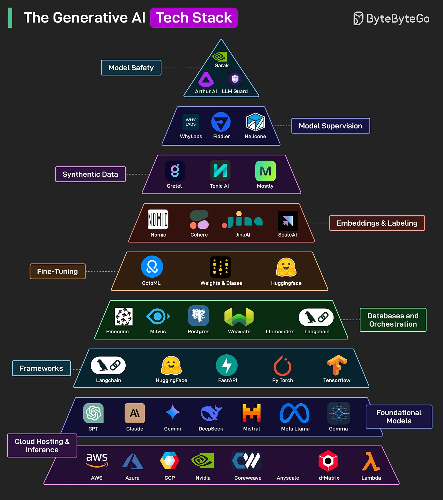
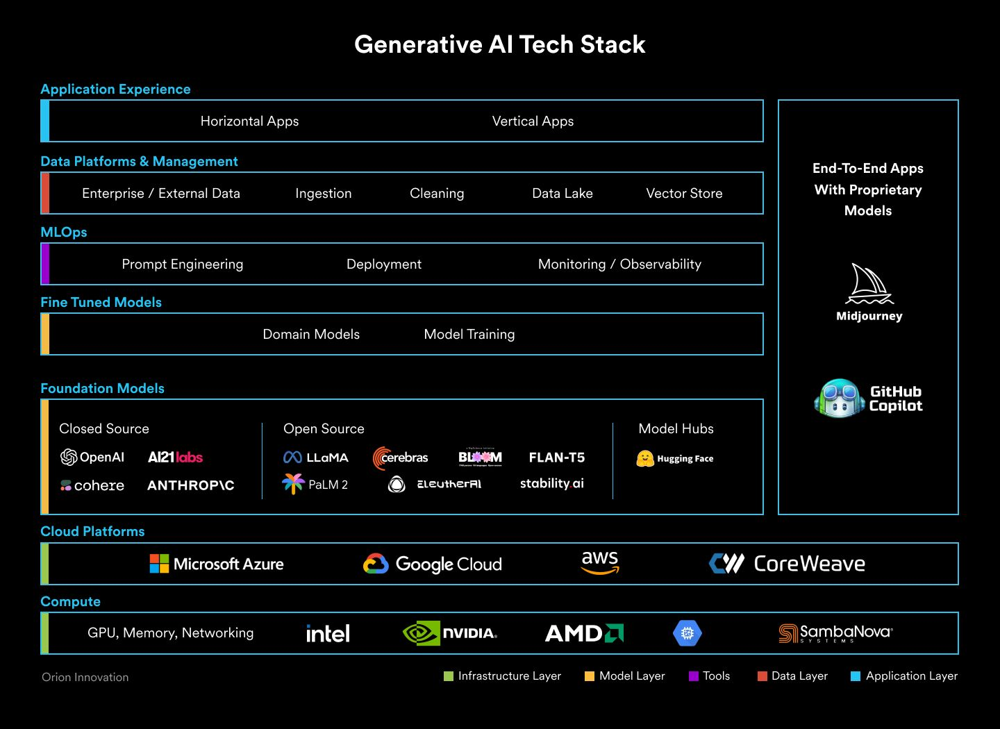
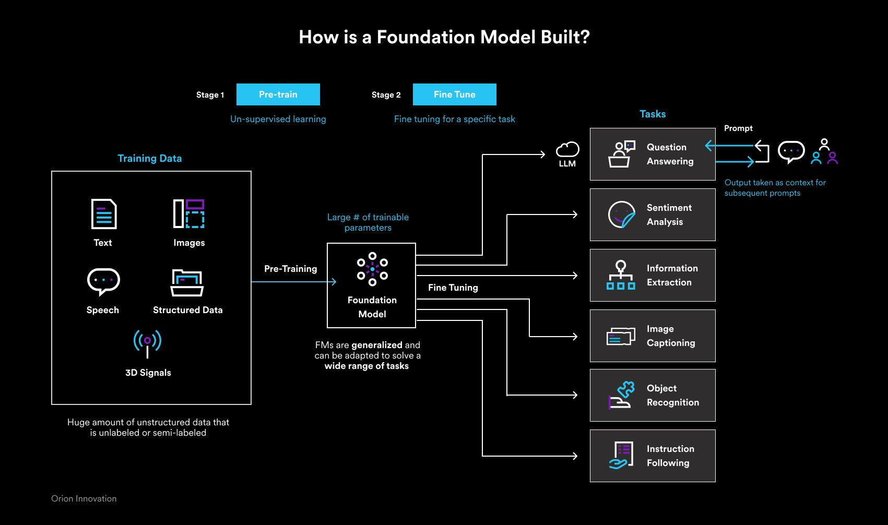

# Generative AI

## Generative AI & Large Language Models (LLMs)

Generative AI

- [What is a Large Language Model (LLM)?](https://www.mlq.ai/what-is-a-large-language-model-llm/)
- Generative AI in Action (2024) by Amit Bahree
- Generative Deep Learning: Teaching Machines to Paint, Write, Compose, and Play (2nd, 2023) by David Foster
- Hands-On Large Language Models: Language Understanding and Generation (2024) by Jay Alammar, Maarten Grootendorst 
- LLM Engineer's Handbook: Master the art of engineering large language models from concept to production (2024) by Paul Iusztin, Maxime Labonne
- Large Language Models: A Deep Dive: Bridging Theory and Practice (2024) by Uday Kamath (Author), Kevin Keenan, Garrett Somers 

Build a LLM

- Build a Large Language Model (From Scratch) (2024) by Sebastian Raschka
- The Hundred-Page Language Models Book: hands-on with PyTorch (2025) by Andriy Burkov

LLM Resources

- [Awesome-LLM](https://github.com/Hannibal046/Awesome-LLM)
- [open-llms](https://github.com/eugeneyan/open-llms)
- [Hugging Face](https://huggingface.co/)
- [civitai](https://civitai.com/)
- [Vercel AI SDK](https://sdk.vercel.ai/docs)
- [魔搭](https://www.modelscope.cn/models) by Alibaba
- https://openi.pcl.ac.cn/modelsquare/main (启智)
- https://www.codewithgpu.com/image

GPU Providers

- [AutoDL](https://www.autodl.com/home)

## Using AI

Using AI

  - AI FOR BEGINNERS: The Ultimate Guide to Mastering Generative Intelligence, From Theory to Practice (2024) by Alan Miller
  - AI Made Simple: A Beginner’s Guide to Generative Intelligence (2023) by Rajeev Kapur

AI-Assisted Programming

- AI-Assisted Programming: Better Planning, Coding, Testing, and Deployment (2024) by Tom Taulli
- Learn AI-Assisted Python Programming: With GitHub Copilot and ChatGPT (2nd, 2024) by Leo Porter, Daniel Zingaro
- Learn Coding with ChatGPT: Introduction to Python & Java, Tips for App, Web & Script Development Paperback (2024) by Manuel Schneider
- AI-Powered Developer: Build great software with ChatGPT and Copilot (2024) by Nathan B. Crocker
- Software Testing with Generative AI (2024) by Mark Winteringham
- "Looks Good To Me": Constructive code reviews (2025) by Adrienne Braganza
- [system-prompts-and-models-of-ai-tools](https://github.com/x1xhlol/system-prompts-and-models-of-ai-tools). FULL v0, Cursor, Manus, Same.dev, Lovable, Devin, Replit Agent, Windsurf Agent & VSCode Agent (And other Open Sourced) System Prompts, Tools & AI Models.

## Vibe Coding

- Vibe Coding: Building Production-Grade Software With GenAI, Chat, Agents, and Beyond (2025) by Gene Kim, Steve Yegge 
- Beyond Vibe Coding: Leveraging Your Experience in the Age of AI (2025) by Addy Osmani

## Prompt Engineering

Books & Tutorials

- Whitepaper on Prompt Engineering by Lee Boonstra [PDF](https://www.gptaiflow.tech/assets/files/2025-01-18-pdf-1-TechAI-Goolge-whitepaper_Prompt%20Engineering_v4-af36dcc7a49bb7269a58b1c9b89a8ae1.pdf)
- [Prompt Engineering for AI Guide](https://cloud.google.com/discover/what-is-prompt-engineering)
- The Art of Asking ChatGPT for High-Quality Answers: A Complete Guide to Prompt Engineering Techniques by Ibrahim John
- The Art of Prompt Engineering with chatGPT: A Hands-On Guide for using chatGPT by Nathan Hunter
- THE POWER OF PROMPT ENGINEERING: HOW TO UNLOCK THE POTENTIAL OF AI LANGUAGE MODELS by Ramandeep Singh
- Prompt Engineering and ChatGPT: How to Easily 10X Your Productivity, Creativity, and Make More Money Without Working Harder by Russel Grant

Articles

- [Prompt engineering - Wikipedia](https://en.wikipedia.org/wiki/Prompt_engineering)
- [A Complete Introduction to Prompt Engineering For Large Language Models](https://www.mihaileric.com/posts/a-complete-introduction-to-prompt-engineering/)
- [Prompt Engineering 101: Introduction and resources](https://amatriain.net/blog/PromptEngineering)
- [Prompt Engineering, Text Generation & Large Language Models](https://cobusgreyling.medium.com/prompt-engineering-text-generation-large-language-models-3d90c527c6d5)

Resources

- [Awesome-Prompt-Engineering - GitHub](https://github.com/promptslab/Awesome-Prompt-Engineering)
- [Prompt-Engineering-Guide - GitHub](https://github.com/dair-ai/Prompt-Engineering-Guide)
- [PromptPapers - GitHub](https://github.com/thunlp/PromptPapers)
- [PromptKG - GitHub](https://github.com/zjunlp/PromptKG)
- [LangGPT - GitHub](https://github.com/EmbraceAGI/LangGPT)
- [Synapse_CoR - GitHub](https://github.com/ProfSynapse/Synapse_CoR)
- [awesome-chatgpt-prompts-zh - GitHub](https://github.com/PlexPt/awesome-chatgpt-prompts-zh)
- [Snack Prompt](https://snackprompt.com/)
- [PromptHero](https://prompthero.com/)
- [PromptPort](https://promptport.ai/)
- [Learn Prompting](https://learnprompting.org/)
- [gptbot](https://gptbot.io/)
- [flowgpt](https://flowgpt.com/)

AI Prompt Tools

- [PromptPerfect](https://promptperfect.jina.ai/)
- [Prompt Generator](https://hero.page/blog/chatgpt-and-midjourney-prompt-generator)

AI Prompt Marketplaces

- [PromptBase](https://promptbase.com/)

AI Prompt Papers

- [Large Language Models Are Human-Level Prompt Engineers](https://arxiv.org/abs/2211.01910)
- [Prompt Programming for Large Language Models: Beyond the Few-Shot Paradigm](https://arxiv.org/abs/2102.07350)

## Build AI Agent

**General**

- [Building effective agents - Anthropic](https://www.anthropic.com/engineering/building-effective-agents)
- AI Agents in Action (2025) by Micheal Lanham
- Building AI Agents with LLMs, RAG, and Knowledge Graphs: A practical guide to autonomous and modern AI agents (2025) by Salvatore Raieli and Gabriele Iuculano
- Principles of Building AI Agents (2025) by Sam Bhagwat
- Agentic AI Handbook: Design Patterns: Build an Agent AI that Thinks, Plans, and Delivers (2025) by Mark Lane

**LangChain & LangGraph**

>To create complex workflows by chaining together different components, such as LLMs, APIs, databases, and custom functions

- Generative AI with LangChain: Build large language model (LLM) apps with Python, ChatGPT, and other LLMs (2023) by Ben Auffarth
- LangChain Crash Course: Build OpenAI LLM powered Apps: Fast track to building OpenAI LLM powered Apps using Python Paperback (2023) by Greg Lim
- Learning LangChain: Building AI and LLM Applications with LangChain and LangGraph (2025) by Mayo Oshin, Nuno Campos

**Retrieval-augmented generation (RAG)**

>Enhancing response accuracy through retrieval.

- RAG-Driven Generative AI: Build custom retrieval augmented generation pipelines with LlamaIndex, Deep Lake, and Pinecone (2024) by Denis Rothman
- Unlocking Data with Generative AI and RAG: Enhance generative AI systems by integrating internal data with large language models using RAG (2024) by Keith Bourne

**Model context protocol (MCP)**

> An open standard designed to bridge AI assistants with the world of data and tools, to plug in many different sources of context.

>An open standard that enables developers to build secure, two-way connections between their data sources and AI-powered tools. The architecture is straightforward: developers can either expose their data through MCP servers or build AI applications (MCP clients) that connect to these servers.

Introducing

- [Introducing the Model Context Protocol - Anthropic](https://www.anthropic.com/news/model-context-protocol)
- [What Is MCP, and Why Is Everyone – Suddenly!– Talking About It?](https://huggingface.co/blog/Kseniase/mcp)
- [Unleashing the Power of Model Context Protocol (MCP): A Game-Changer in AI Integration](https://techcommunity.microsoft.com/blog/educatordeveloperblog/unleashing-the-power-of-model-context-protocol-mcp-a-game-changer-in-ai-integrat/4397564)

Resource

- [Model Context Protocol](https://modelcontextprotocol.io/introduction) November 2024
- [Anthropic Agents and tools](https://docs.anthropic.com/en/docs/agents-and-tools/mcp)
- [OpenAI Agents SDK](https://openai.github.io/openai-agents-python/)

## Build AI Applications

- Building Agentic AI Systems: Create intelligent, autonomous AI agents that can reason, plan, and adapt (2025) by Anjanava Biswas , Wrick Talukdar
- The AI Engineering Bible: The Complete and Up-to-Date Guide to Build, Develop and Scale Production Ready AI Systems (2025) by Thomas R. Caldwell
- Building Applications with AI Agents: Designing and Implementing Multi-Agent Systems (2025) by Michael Albada
- AI Engineering: Building Applications with Foundation Models (2025) by Chip Huyen
- LLMs in Production: From language models to successful products (2025) by Christopher Brousseau, Matt Sharp
- Prompt Engineering for Generative AI: Future-Proof Inputs for Reliable AI Outputs (2024) by James Phoenix (Author), Mike Taylor
- Prompt Engineering for LLMs: The Art and Science of Building Large Language Model-Based Applications (2024) by John Berryman (Author), Albert Ziegler
- Building LLM Powered Applications: Create intelligent apps and agents with large language models (2024) by Valentina Alto
- AI Product Manager's Handbook: The ultimate playbook to unlock AI product success with real-world insights and strategies (2nd, 2024) by Irene Bratsis
- Simplified Generative AI Architecture Design Guide (2025) by Zephyr Nolan, Techcore Publishing
- Building LLMs for Production: Enhancing LLM Abilities and Reliability with Prompting, Fine-Tuning, and RAG (2024) by Louis-François Bouchard, Louie Peters
- Generative AI on AWS: Building Context-Aware Multimodal Reasoning Applications (2023) by Chris Fregly, Antje Barth, Shelbee Eigenbrode 
- Quick Start Guide to Large Language Models: Strategies and Best Practices for Using ChatGPT and Other LLMs (2023) by Sinan Ozdemir 
- OpenAI API Cookbook: Build intelligent applications including chatbots, virtual assistants, and content generators (2024) by Henry Habib
- Developing Apps with GPT-4 and ChatGPT: Build Intelligent Chatbots, Content Generators, and More (2023) by Olivier Caelen, Marie-Alice Blete

## AI Business

- AI AGENTS UNLEASHED: Automate Everything, Save Hours Daily, and Scale Your Business Without Writing a Single Line of Code (2025) by Avery Smartwell
- **AI Entrepreneur’s Handbook: Build a Profitable Business and Make Money** by Unleashing the Power of ChatGPT and Artificial Intelligence (Includes 150+ ChatGPT prompts to turbocharge your business) (2024) by Kartikeya Malhotra
- Agentic Artificial Intelligence: Harnessing AI Agents to Reinvent Business, Work and Life (2025) by Pascal Bornet (Author), Jochen Wirtz (Author), Thomas H. Davenport
- AI Agents Explained for Business Leaders: Harness Agentic AI Systems and Intelligent Automation to Supercharge Workflows, Unleash AI-Powered Growth ... (Generative AI & Chat GPT Mastery Series) (2025) by David M. Patel
- The Chief AI Officer's Handbook: Master AI leadership with strategies to innovate, overcome challenges, and drive business growth (2025) by Jarrod Anderson (Author), Jeff Winter
- **The ChatGPT Millionaire: Making Money Online has never been this EASY** (2023) by Neil Dagger
- Broke to Billionaire: How to Make Money Online with Ai Paperback (2023) by Brandon Chan
- AI Guide for Beginners: How to Use AI Prompts & Master Artificial Intelligence in 4 Practical Days (21 Days To Make Money With AI) (2024) by Tigran Voskanyan
- How to Make Money Online Using ChatGPT: Quit Your Day Job and Earn Full-Time Income Using ChatGPT Even if You Have Zero Experience (A Complete Easy-to-Understand and Up-to-Date Guide for Beginners) (2023) by Andrew Harrisson
- The AI Entrepreneur: How to Make Money with AI: From Idea to Launch — Build, Fund, Market, and Scale Your AI Business in 90 Days or Less (2024) by Malick Alexandre Sarr
- ChatGPT for Beginners Made Easy: Learn the Basics, Master Prompts, Boost Productivity, and Cash In With Conversational AI (AI for Beginners Made Easy) (2023) by ModernMind Publications
- Unleashing the Millionaire Power of ChatGPT: Make More Money as a Beginner, Entrepreneur, or Business Owner with AI Chatbots & Custom Prompts - Boost ... Creation (Money Mastery in the Digital Age) (2023) by FutureFront Publishing

## Open AI

> ChatGPT uses a specific type of reinforcement learning called "Reinforcement Learning from Human Feedback (RLHF)", at a high level it is an example of a Large Language Model (LLM).

- [Open AI API](https://platform.openai.com/overview)

Papers

- [GPTs are GPTs: An Early Look at the Labor Market Impact Potential of Large Language Models](https://arxiv.org/abs/2303.10130#), 17 Mar 2023

## Ranking and Trends

- [Gartner Hype Cycle Identifies Top AI Innovations in 2025 - Gartner](https://www.gartner.com/en/newsroom/press-releases/2025-08-05-gartner-hype-cycle-identifies-top-ai-innovations-in-2025)
- [AI trends in 2025: What we’ve seen and what we’ll see next](https://www.ibm.com/think/insights/artificial-intelligence-trends)
- [Trends – Artificial Intelligence - Bond](https://www.bondcap.com/reports/tai)
- [Artificial Analysis AI Trends - Artificial Analysis](https://artificialanalysis.ai/trends)
- [6 AI trends you’ll see more of in 2025](https://news.microsoft.com/source/features/ai/6-ai-trends-youll-see-more-of-in-2025/)
- [The 2025 AI Index Report - Stanford HAI](https://hai.stanford.edu/ai-index/2025-ai-index-report)
- [5 AI Trends Shaping Innovation and ROI in 2025 - Morgan Stanley](https://www.morganstanley.com/insights/articles/ai-trends-reasoning-frontier-models-2025-tmt)
- [131 AI Statistics and Trends for 2025](https://www.nu.edu/blog/ai-statistics-trends/)
- [5 AI trends shaping the future of the public sector in 2025](https://cloud.google.com/blog/topics/public-sector/5-ai-trends-shaping-the-future-of-the-public-sector-in-2025)
- [Unlocking Generative AI’s Potential To Drive Business Growth](https://www.forrester.com/technology/generative-ai/)
- [The State of AI: Global survey - McKinsey](https://www.mckinsey.com/capabilities/quantumblack/our-insights/the-state-of-ai)

## Appendixes

Tech Stack

How is a foundation model built?

